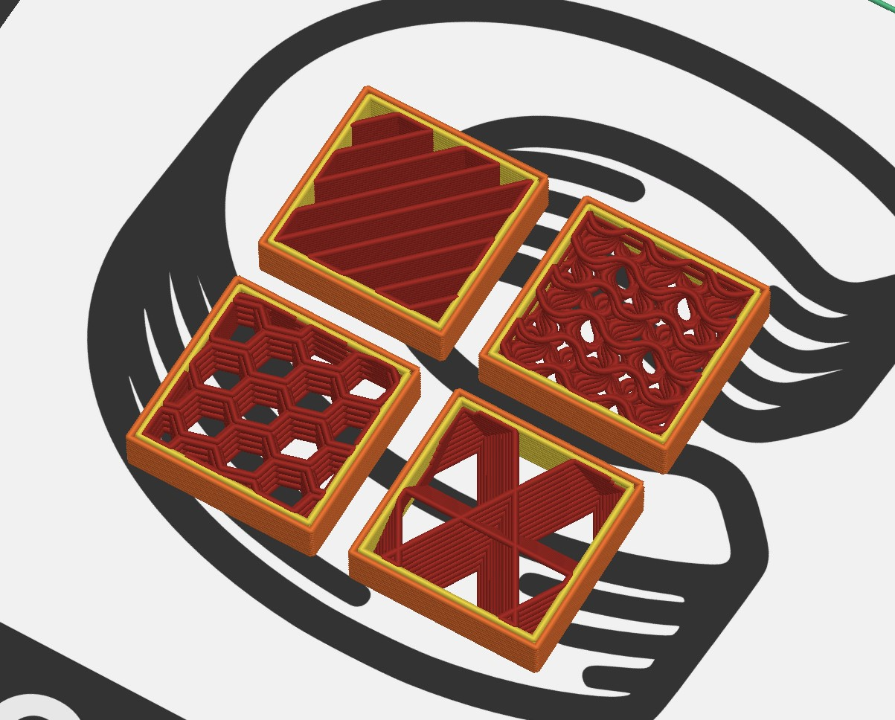

# Fused Food Fabrication and You

FFF, or [Fused Filament Fabrication](https://en.wikipedia.org/wiki/Fused_filament_fabrication), is typically the category of addictive manufacturing where some material is extruded through some nozzle and moved to produce a design in 3-dimensional space.  This typically refers to plastic 3D printers, but in our case, is that of fused *food* fabrication.

<!-- TODO Add gif of printer in motion / cut webm of printer working -->

The Cocoa Press works similarly to plastic printers in theory, the extruder is moved around the workspace of the printer, extruding warm material (chocolate) and cooling through ambient temperatures to produce novel and interesting designs!

## Textures and Infill

FFF can enable some incredible designs that wouldn't be possible with any other method of manufacturing, especially for chocolate. 

Traditional chocolate-making techniques and your Cocoa Press can also be combined.  Below is a bon-bon, where the interior of this bon-bon was FFF printed out of white chocolate, and the shell was molded to produce an airy and light texture.

The [Slicer](./index.md#the-slicer) allows you to change the "infill pattern", or what pattern it uses for the interior structure of your tasty prints.  Some common examples that work well are gyroid, adaptive cubic, or concentric.  

!!! tip
    The above screenshot has "top layers" and "bottom layers" in the slicer profile set to "0" to reveal the interior infill.  This technique is used in the Cocoa Press texture samples that come on your printer's SD card.  Try it out!

## Overhangs

Printing with your Cocoa Press can enable some overhangs in designs, and especially interior designs that simply aren't possible in a single mold.

The ["Benchy"](https://www.3dbenchy.com/) test print for 3d printing is a good indicator, with the interior detail of the "cabin" being impossible to produce with traditional molding.

## Support

As a user, you can use support structure, where chocolate is used as scaffolding for the rest of your print, to support large overhangs.  As chocolate cools, it doesn't instantly solidify, so this is an important step for most FFF printers as well.  Alternatively, you might be able to just look at models that already have support built-in, or better yet, don't need it at all.  Some parts of the Cocoa Press are actually printed with integral supports.

An example of a print that expects support might be the [extruder cover piece](https://github.com/CocoaPress/PrintedParts/blob/main/STLs/XY%20Gantry/X%20Gantry/Extruder/extruder_shell_front.stl), where a print that doesn't need it (especially if some small overhangs and drooping is acceptable) might be the [Benchy](https://www.3dbenchy.com/), where depending on a wide variety of factors, can effect the output quality.

!!! info
    The content in green in the above screenshot are "organic" supports, a newer style that uses less material for other forms of FFF printing. The parts in orange and blue are the actual material used for the print in question.

    Above print is the top half portion of the 3D Benchy model scaled up.