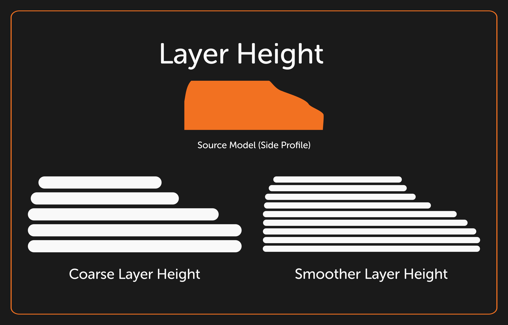
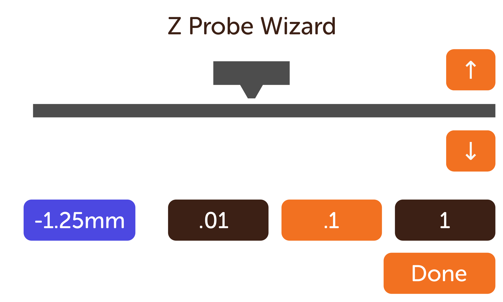

# Layer Height & Z-Offset

The "layer height" is the literal height of the layer of chocolate before the printer lowers the bed to print the next layer.  Different nozzle sizes change the maximum layer height, and by extension, how fast you can print the same model, but there's a resolution tradeoff.  The finer the layer height, the slower the print is.

Different nozzles constrain the maximum layer height you can print with before the chocolate can't consistently connect to the layer prior.  This is (generally) between ½ and ¾ths of the nozzle diameter (ie .4mm layer height for a 0.8mm nozzle).   Chocolate as a material is somewhat forgiving for layer height, allowing some generous overhangs.

## Z Offset

Z offset describes the space the printer adds to the detection area of your printer to define the "zero" of the print area's height.  Too far away and the first layer of chocolate doesn't solidly link to the silicone baking sheet.  Too close, and your nozzle will collide with the silicone baking sheet.  

This setting is user adjustable and can be tuned in the [Z Offset Wizard.](../Advanced/Troubleshooting.md#probe-mesh-area)

