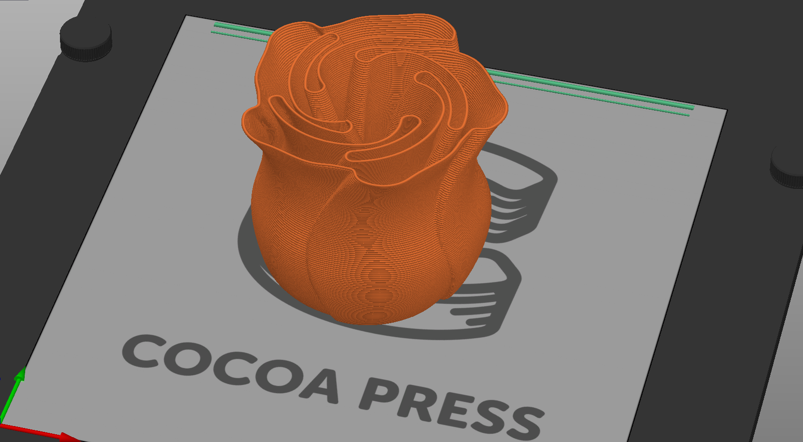

# Finding 3D Models to Print

Many users share models they make online for use by others, but there are some key criteria you may want to look at to ensure they'll print successfully with your Cocoa Press.

## Site Choices

- [Thangs](https://thangs.com/)
- [Printables](https://www.printables.com/)
- [Thingiverse](https://www.thingiverse.com/)

!!! warning
    It's important to verify you can legally use the file you're trying to print; otherwise you might violate the terms of use of the model or design. Please check the copyright note within the files you download, on the download page, and when published by the author.  

## "Vase Mode" / "Single Line" Style

A common style of print that is likely to work with your Cocoa Press is that of "vase mode", where the printer will extrude a continuous "loop" of filament, spiraling up as it prints.  This is called a "vase mode" print as some of the easiest models to print are vases for flowers or decoration.

One such example might be this [Vase Mode Rose model by lytta on Printables](https://www.printables.com/model/131488-spiral-vase-rose/):

To enable Vase Mode printing, see this guide in the [Advanced Slicer Setup](../Advanced/Slicer.md#vase-mode) section.

## Articulating Prints

Some articulating prints (like these) might work on your Cocoa Press, you'll want to inspect the layer size to ensure that there's enough chocolate in the hinges, articulating portions, and other pivoting pieces.  Otherwise, they'll be incredibly susceptible to breakage.

<figure markdown>
  
  <figcaption><a href="https://cults3d.com/en/3d-model/game/pepito-the-benchmark-goldfish">Pepito the Goldfish</a></figcaption>
</figure>

## Model Repair

Certain models you might find are not manifold, or a "closed shape", and cannot be treated like a solid object.  Most 3d models are a series of small triangles called a "mesh", and holes in the mesh can produce impossibly thin and sharp corners that computers struggle to work with, much less a 3D printer to extrude.

<!-- TODO get screenshot of PrusaSlicer with caution triangle we can use, etc. -->

PrusaSlicer will show a caution triangle in the Model Browser (the right pane) if your model is damaged or has geometry issues, and if you are using Windows 10, PrusaSlicer can automatically use the Netfabb service via Microsoft to repair the model automatically.  

There are other options for model repair listed both cloud and local.  For more information, see [this PrusaSlicer help center article](https://help.prusa3d.com/article/corrupted-3d-models-for-printing_2205), and [this Prusa blog article.](https://blog.prusa3d.com/repair-3d-models-errors_7529/)

