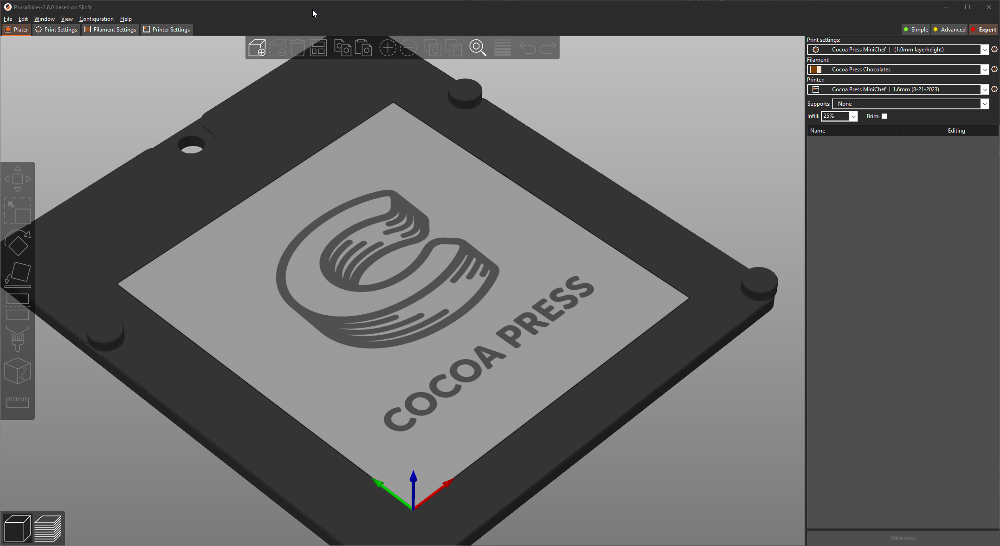
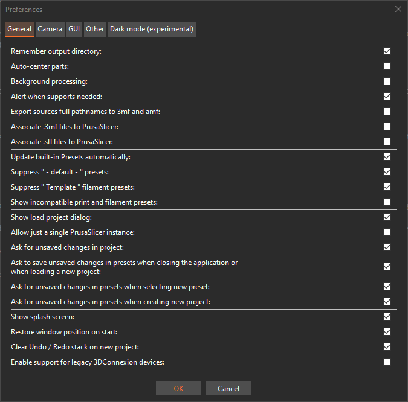

# The Slicer

The slicer is a tool you use to convert 3D models downloaded or made on your computer to instructions for layer-by-layer fabrication by your Cocoa Press.  Since each 3D printer is different, we need to use a specific "profile", or machine configuration, to tell the slicer to produce information for the Cocoa Press specifically.  This tool is akin to the printer driver configuration for a paper printer.  One might change the collation settings, margins, rotation, resolution, black and white or color printing, and more.  The Slicer does the same *type* of work to prep your printer for making your delicious creations.

PrusaSlicer is the slicer you'll be using for your Cocoa Press machine to make custom chocolate prints, developed as open source software and forked (split off from) the original [Slic3r](https://slic3r.org/) software.

You can download PrusaSlicer [here.](https://www.prusa3d.com/page/prusaslicer_424/)

[PrusaSlicer Download :material-download:](https://www.prusa3d.com/page/prusaslicer_424/){ .md-button .md-button--primary}

## Setup

Once you've gotten PrusaSlicer installed, you'll need to configure it for use with your Cocoa Press.  Those steps can be found [here](../Printer/SlicerSetup.md).

## PrusaSlicer Tour

Many of the top-bar menus in PrusaSlicer (File, Edit, Window, etc.) either have on-screen controls to be used without the top-menu, or keyboard shortcuts to make it easier to use on repeat viewings.

File -> Import (++ctrl+i++) allows you to import models that other people have made as STLs, OBJ, STEP, and other file formats.

File -> Open (++ctrl+o++) is used to open existing PrusaSlicer projects, such as models you've set up and configured for printing.

## Model View / 3D View

Window -> 3D (++ctrl+5++)  This is the view of your model before it's been processed into instructions for your printer to follow.  You can also use the button in the bottom left to get back to this view.

## Sliced View / Preview View

Window -> Preview (++ctrl+6++) The process of turning your imported model(s) into instructions your printer can follow can be done with the button in the bottom right menu, called the "Slice" button (++ctrl+r++).  

## File Exports

To make instructions for your Cocoa Press, they'll be saved as a GCode file, which is a language for specific digitally controlled machines (3D printers, some laser cutters, large industrial machinery, etc.) on how to manufacture the object you're instructing it to.

!!! warning
    GCode files are machine specific, so if you've set up a slicer for a specific printer (your Cocoa Press), using GCode for a different printer could damage it, and vice versa also applies.  Some printers have safety checks, some do not.  Caution is advised!

## File Imports

PrusaSlicer can import a variety of model types, as well as machine configurations if a file was sliced for a given printer was exported with those settings saved in the instructions.

### Import Config Bundle

This menu item is how users are expected to import experimental or legacy Cocoa Press printer configurations.  See further instructions [here](#). <!-- TODO Add import config instructions -->

## Useful Settings

### Running More Than One Copy

macOS users may expect to be able to only open a single "instance" (running copies) of PrusaSlicer, and to make working with multiple print plates simultaneously easier, they added a toggle for this.

Users can either open the "Window" Menu and click "Open New Instance" or by pressing ++ctrl+shift+i++ to open a new instance.   

Configuration -> Preferences -> General should have an item approximately half-way up that states:

`Allow just a single PrusaSlicer instance`

Ensuring this *isn't* selected will allow macOS to open more than one copy of PrusaSlicer simultaneously.   

### Advanced Use

This guide will explain more in-depth uses of PrusaSlicer with your Cocoa Press.  Follow it here.

[Advanced Slicer Use :material-arrow-right:](https://www.prusa3d.com/page/prusaslicer_424/){ .md-button .md-button--primary}
