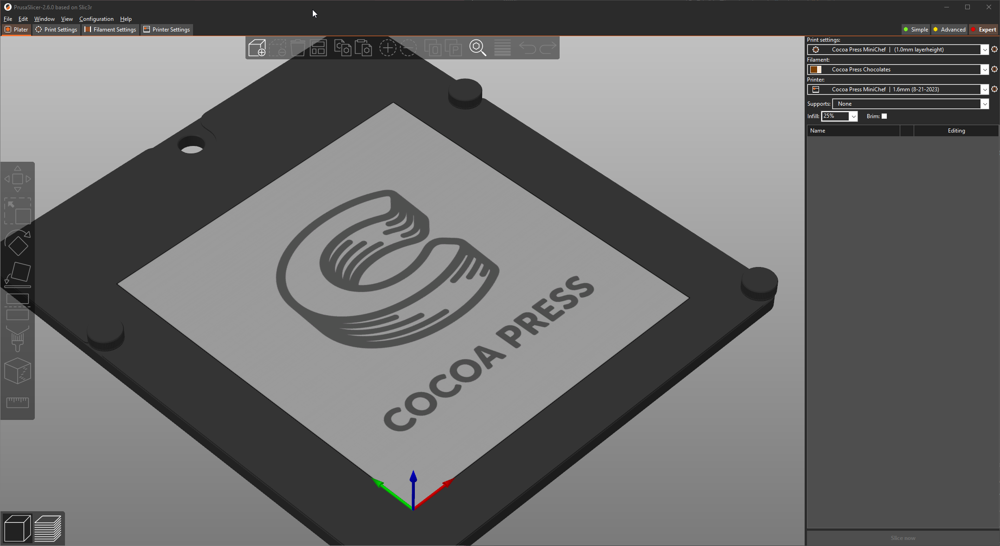
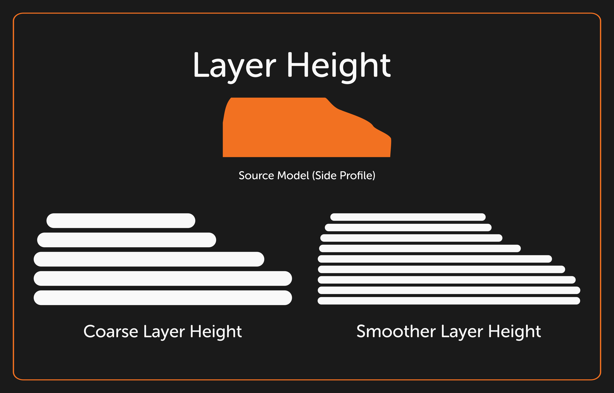

# Printing 101

Here we'll discuss the basics of 3D printing, and the steps you'll need to get your printer working, tuned, and dialed in for crisp-looking, tasty prints!

### FFF And You

FFF, or [Fused Filament Fabrication](https://en.wikipedia.org/wiki/Fused_filament_fabrication), is typically the category of addictive manufacturing where some material is extruded through some nozzle and moved to produce a design in 3-dimensional space.  This typically refers to plastic 3D printers, but in our case, is that of fused *food* fabrication.

The Cocoa Press works similarly to plastic printers in theory, the extruder is moved around the workspace of the printer, extruding warm material (chocolate) and cooling through ambient temperatures to produce novel and interesting designs!

### The Slicer

The slicer is a tool you use to convert 3d models downloaded or made on your computer to instructions for layer-by-layer fabrication by your Cocoa Press.  Since each 3d printer is different, we need to use a specific "profile", or machine configuration, to tell the Slicer to produce information for the Cocoa Press specifically.

### Layer Height & Z-Offset

The "layer height" is the literal height of the layer of chocolate before the printer lowers the bed to print the next layer.  Different nozzle sizes change the maximum layer height, and by extension, how fast you can print the same model, but there's a resolution tradeoff.  The finer the layer height, the slower the print is.

## Nozzle Size

The Nozzle of a printer describes the diameter of the hole the additive material is extruded through.  Many plastic 3D printers use a .4 or .6mm nozzle, and your Cocoa Press comes with a .8mm nozzle. This means that the smallest size a single line the printer can print is .8mm, and any thicknesses greater than that will either use infill to compensate, or  make the innermost layer(s) extrude less material as though it had a smaller nozzle.

<!-- nozzle size image -->

## Motion Systems

Your Cocoa Press uses a configuration for moving the extruder you might not have seen before.  A CoreXY system (as described here) uses an "A" and a "B" stepper motor, to combine their motion to move the extruder.  A more "classic" motion system would have one motor per axis, but the CoreXY allows the printer to accelerate the extruder with *both* motors.  This allows faster acceleration while keeping individual motor load spread out.

For more information on CoreXY motion systems, please refer to this [site](https://corexy.com/) on CoreXY cartesian motion systems.