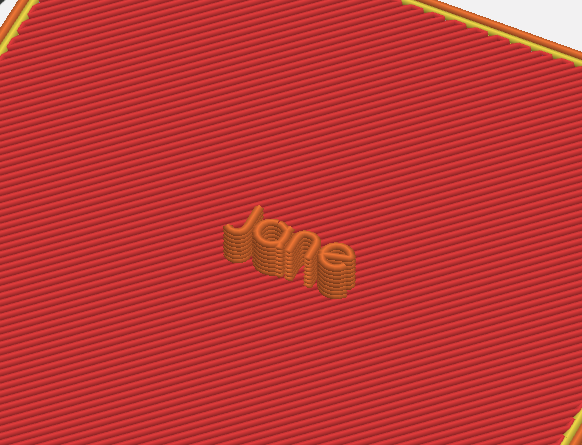
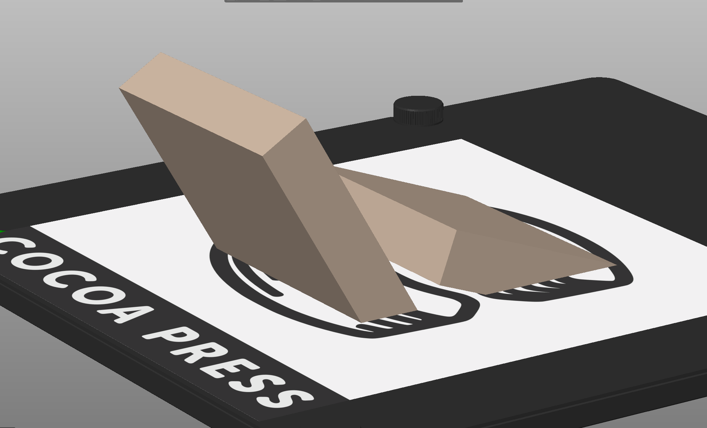
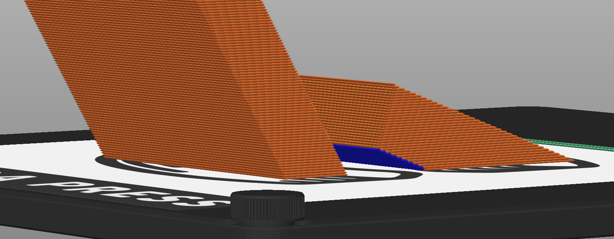

# Designing Your Own Chocolate Prints

The pre-existing models one can find for printing may not satiate your needs for chocolate confections.  Here's some tips to make your life easier as you begin to design for chocolate printing.

## In-Slicer

The text tool can be used standalone to make people's names, emboss existing models, and more.  

=== "Model View"

    

=== "Sliced View"

    

You should still be aware of the minimum thickness of text and verify how it looks in the sliced view, as there is a minimum effective size.

!!! info
    The below images show the text above with the size being too small to reliably recreate with your printer.  Text height below this may not even produce the correct slicer instructions.

    

## CAD Tools

Ensure any hinges or thick walls have a minimum diameter that matches the [nozzle size](../101/index.md#nozzle-size) you're using for your print.

It's highly suggested you verify your overhang distances and angles, as the ability of chocolates to bridge and overhang will vary depending on environmental humidity and temperature.

!!! tip
    The Cocoa Press PrusaSlicer profile will call out egregious overhangs (as depicted below in the Sliced View in blue.) 

    === "Model View"

        

    === "Sliced View"

        

