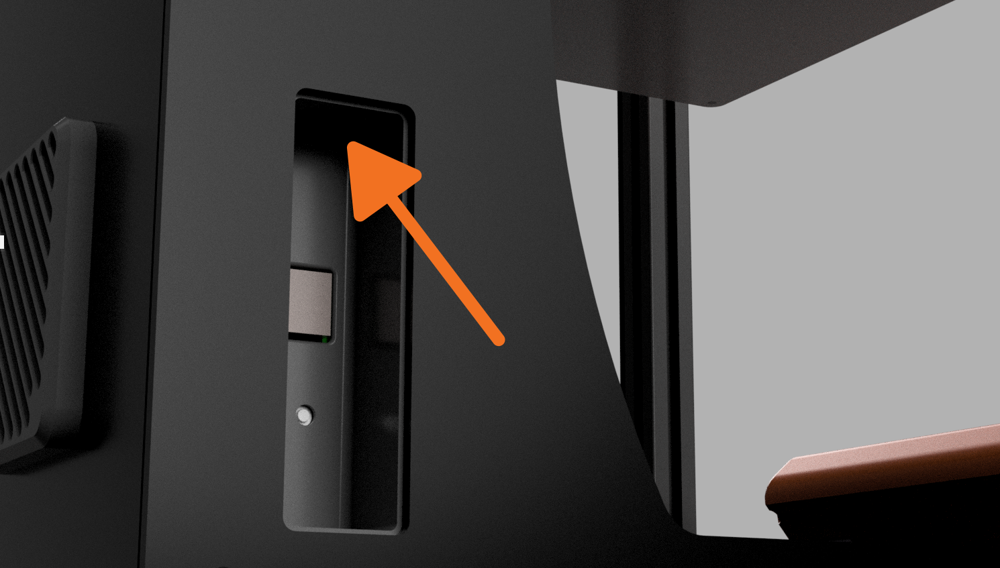
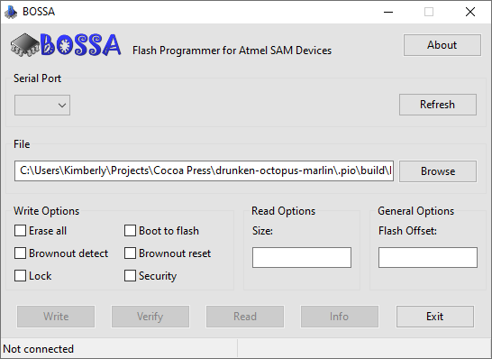
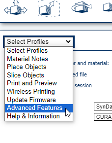
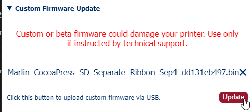

# Flashing New Firmware

To update the firmware on your printer, you'll need to use Shumatech BOSSA, the preferred flashing tool for the brains of the Cocoa Press.

## Prep

- Before flashing, be sure that your printer is completely off.
- Using the erase button inside the USB panel on the left side of the printer, hold this button while turning the printer on.  After three seconds, you can release.

- Connect the printer to your computer via USB.

<!-- TODO Add printer hardware button photo -->

!!! info
    To ensure that you followed the above setup steps correctly, you'll want to ensure that your Cocoa Press' screen is *not* on.  Nothing showing on the screen means it's in update mode.

### Download

Download the preferred version of BOSSA for your computer from GitHub [here.](https://github.com/shumatech/BOSSA/releases)

!!! caution
    There are known issues with desktop BOSSA not working correctly on macOS M1/M2 computers.  Please see the [below steps](#apple-silicon-mac-steps) for a workaround.

    If you're a technical user, there appears to be a workaround listed [here](https://forum.duet3d.com/topic/11445/flashing-firmware-on-mac-os-x/2) to use desktop BOSSA, but you should only use this fix if you know what you're doing.

Download the latest Cocoa Press firmware from [here.](#) <!-- TODO ADD FIRMWARE LINK -->

When opening BOSSA, it should look like this.  

{ align=center}

Use the "File" section to choose the firmware for the printer.  

Select the appropriate serial port for your printer.  

!!! info
    BOSSA will show "connected" with a string of letters and numbers including "SAM" if it's the correct connected device.  

Select "Erase All" and "Boot to flash", then "Write" to put the new firmware on your printer.

## Apple Silicon Mac Steps

To flash to your Macintosh, SynDaver has made a web slicer that includes flashing firmware tools for the type of control board your Cocoa Press uses.  In short, it can be used to update your printer's firmware same as BOSSA above can be.

!!! note
    This beta tool only works on Chrome due to the use of webUSB.  Safari and Firefox don't yet support WebUSB.

Open the SynDaver Web Slicer Beta [here.](https://syndaverco.github.io/slicer-beta/)

In the left-pane, use the dropdown to select "Advanced Features".

Expand the "Custom Firmware Update" button and use the file picker to select the CocoaPress.bin firmware downloaded earlier.

Click the "Update" button, and select the serial port attached to your Cocoa Press.

<!-- TODO: Add Chrome menu of flashing it. -->