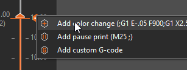

# Larger Prints with Color Change & Pause

## Pause Print

PrusaSlicer and Marlin Firmware allow you to instruct your printer to pause at a given point in the print.  This can allow you to make creative and imaginative prints, like hot cocoa bombs! <!-- TODO link hot chocolate cocoa bombs and/or add photos. -->

In the [sliced view](../101/Slicer.md#sliced-view--preview-view), use the arrow sliders on the right pane of the view to go up and down through the layers printed, and right click the "plus" icon to bring up the menu. Select "Add pause Print".

!!! info
    PrusaSlicer exports an `M117` command by default.  Our output options for the slicer turn it into an `M0` message to make it a billboard message instead, so that the user will actually *see* the message input into the slicer.  This ensures the user can see the print is paused and waiting on user input before continuing.

    <!-- todo add photo of big billboard on the printer -->

## Core Change

In the [sliced view](../101/Slicer.md#sliced-view--preview-view), use the arrow sliders on the right pane of the view to go up and down through the layers printed, and right click the "plus" icon to bring up the menu. Select "Color Change".  This will pause the print at the specified point, and move the nozzle out of the way.

!!! note
    Beta firmware and firmware prior to release 1.0 will not have this feature enabled correctly.  PrusaSlicer config 1.0.0 will *also* not have it enabled correctly and thoroughly.  Be sure to update both through their respective steps [here](../Advanced/Flashing.md) and [here.](../Printer/SlicerSetup.md#configuration-wizard)

With the printer paused during the print, use the Load / Unload menu to load your new core.

Afterwards, use the preheat menu same as with normal [Cocoa Core loading](../Printer/Loading.md) to start the preheat timer.

When the timer is done, lean the nozzle of any debris on the nozzle tip to minimize the potential of interfering with the print as completed so far.

Afterwards, use the extrude button to ensure flow of chocolate and allow flow to stop before resuming.

Re-latch your extruder, and press the "resume" button on the main screen.  The print should continue as expected.

!!! tip
    In the event you bump the extruder while loading a core mid-print, you'll want to home the extruder in X & Y and *not* Z.  Homing in Z will potentially result in the extruder crashing through your chocolate print.