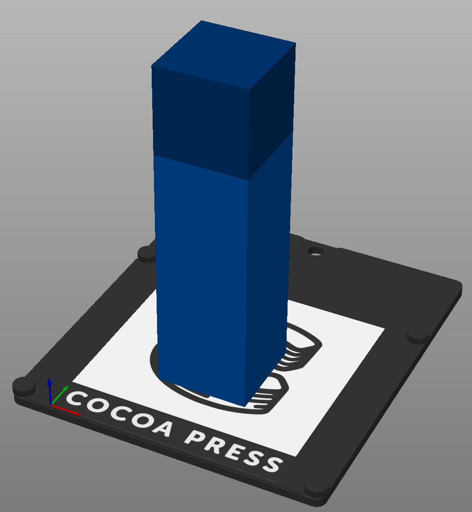
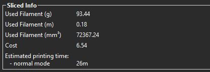
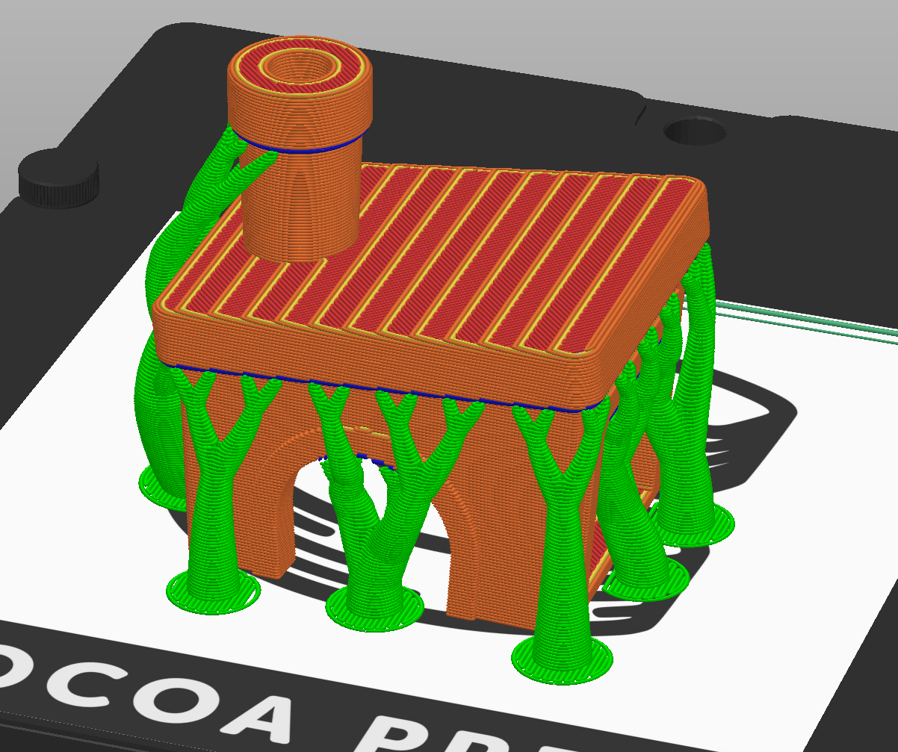

# What Can You Print?

Some restrictions on how FFF printing works will limit how you use your Cocoa Press successfully.

## Maximum Volume

Due to the maximum build volume of the printer, you can't exceed the 140x150x150mm volume of the printer.  

## Maximum Chocolate

Without doing a [mid-print core change](LargePrints.md), you can't use more chocolate than in a single core.  Attempting to use more will *not* prompt the user as-is, so pay attention to the material used in the bottom right corner of the sliced view.

## Overhangs

If printing a large, unsupported area, you'll likely need to use [supports](./Slicer.md#supports), or print the model in multiple pieces and join it via other mechanisms.

Alternately, you can make use of supports, where more chocolate is used to generate structures for the printer to use as scaffolding.  Below depicted is a version of that.

