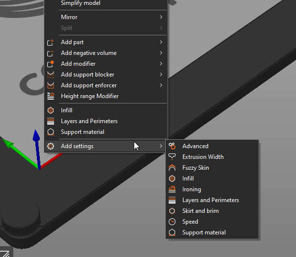

# In-Depth PrusaSlicer Use

## Model Overrides

PrusaSlicer allows you to override specific properties of a model loaded into a slicer, such as infill, speed, temperature, and more.  You can change this from the [3D View](../101/Slicer.md#model-view--3d-view) by right clicking on the part and selecting "Add Settings" at the bottom of the right-click menu.

## Text on Surfaces

PrusaSlicer allows you to add text onto a surface of any model by selecting the model in the [3D View](../101/Slicer.md#model-view--3d-view) and pressing ++t++ on your keyboard, or by right-clicking on the model and selecting the "Add Part" -> "Text" menu item. 

You can use any and all TrueType fonts you have installed on your computer, and can adjust placement with some careful selection.

For more information, look at the [Text tool](https://help.prusa3d.com/article/text-tool_399460) section in the PrusaSlicer documentation.

!!! note
    Do be aware that the slicer will not render text below the resolution of a single linewidth in many cases.  As such, you'll need to make your text large enough to be extruded.

    

## Vase Mode

Vase mode allows you to print certain models as a continuous line circled up and up, allowing for large, thin prints.

To enable, go to Print Settings in PrusaSlicer, Layers and Perimeters, Vertical Shells, and select "Spiral Vase".

!!! info
    The slicer will have to change multiple settings to make this type of print actually manufacturable.  It's important that you check the geometry is able to be printed and doesn't produce any warnings or error messages before printing.  Many vase mode prints will be labeled as such.  for more information, see [Model Selection](../101/Models.md#finding-3d-models-to-print).

## Sequential Printing

When making larger batches of prints, you may be able to print *sequentially*, where one object in the slicer is printed, then the next, and so on.  This is only possible if the extruder doesn't collide with your models.  

To check, check the PrusaSlicer "Print Settings" -> "Output Options" -> "Complete individual objects".

If there's a red radius around the objects, they're too close to print sequentially, as the extruder will collide with the part when going to print the second part.

