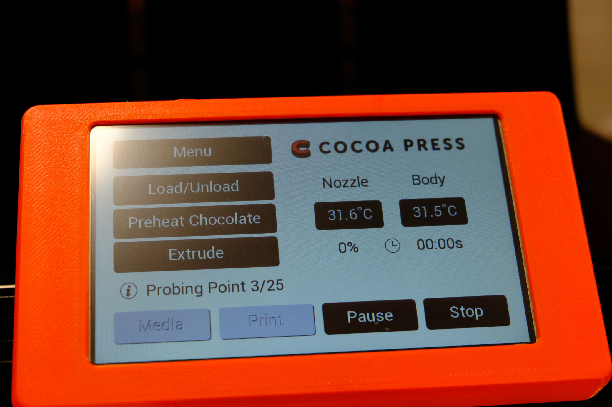
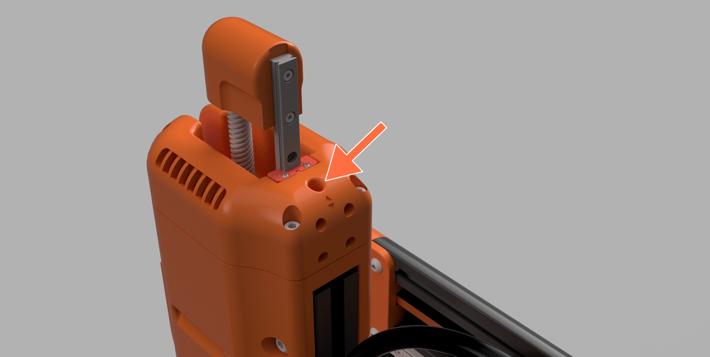
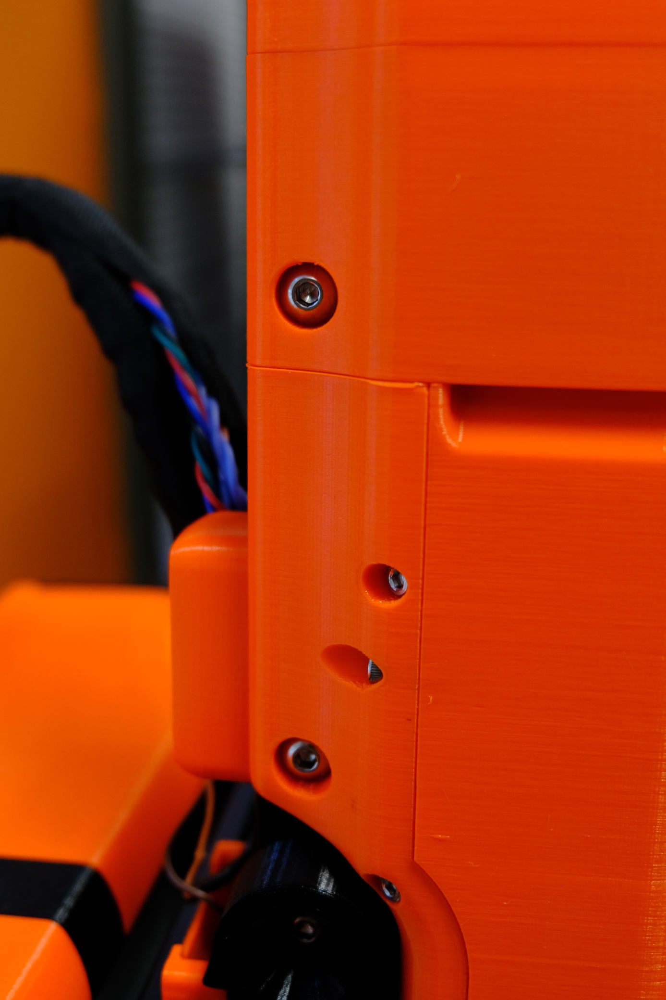
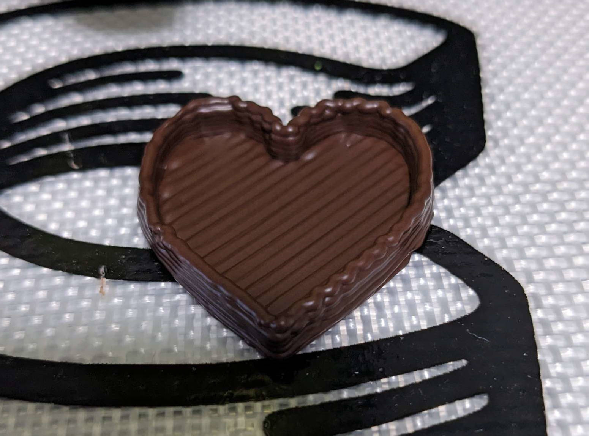

# Troubleshooting For Advanced Users

## Electronics & Setup Troubleshooting

### My Display Won't Turn On

If your display is not showing content after assembling the printer, you may want to verify the order of your EXP1/EXP2 cables matches the assembly manual.  Swapping the cables won't *damage* your printer, but it will result in the controller not knowing the correct "location" of your display and SD card reader.

### My Display is All White
If your display after assembly is showing a full white screen and nothing else, it's possible your flat flex cable (FFC) between the actual LCD Panel and your display controller isn't properly seated.  Follow the display assembly steps in the [Assembly Manual](../Assembly/index.md) and verify that the cable is fully inserted.

### Probe Only Meshes One Point

In the event of an electrical or wiring issue that causes your probe to be disconnected, your printer will be unable to mesh the bed or adjust the probe offset correctly.  You can use the `Advanced Settings -> Endstops` menu to diagnose this setup.

The 'disabled' state of an endstop is grey, an "off" endstop is Cocoa Press brown, and the "on" state is Cocoa Press orange.  If using the spatula doesn't change the state of the Z_MAX endstop, please contact support at <a href="mailto:hello@cocoapress.com">hello@cocoapress.com</a> for further diagnostic help.

### Printer is at -65C?  How?

When a thermistor (temperature sensor) for the extruder is disconnected, the display on the homepage may show one temperature value as being -65C.  Preheating your Cocoa Cores will cause a MIN_TEMP error as listed [above](#the-printer-is-reporting-min_temp-and-not-letting-me-print).

This can be a wire plugged into the wrong port (verify the connectors match the Assembly Manual), or a crushed wire.  For further assistance please join our Discord and open a ticket, or email support.  

## Extrusion & Printing Troubleshooting

### First Layer Height Issues

To ensure a consistent and reliable first layer with your Cocoa Press, you'll need to ensure your Z probe is mounted ridigly via the two M3 screws, and that your extruder doesn't wobble during normal operation.

You'll also need to ensure that your printer has probed the print bed for consistently and leveling.  

### Probe Mesh Area

This can be checked in the menu under Menu -> Mesh Leveling -> Probe Mesh.

The printer will take about three minutes and probe the printable area of the bed.  If this step collides with anything, you'll want to look into [adjusting your extruder height.](#adjusting-extruder-height)

### Z-Offset

If probing completes successfully, you'll need a sheet of plain printer paper to adjust the Z-offset.  Using the Menu -> Probe Z Offset.  Follow the steps on screen to adjust the spacing between your nozzle and bed for a consistent first layer.

Your paper should slide under the nozzle with a small amount of resistance, but not enough to tear or catch. This will ensure the nozzle can skim the top surface of the silicone baking sheet would damaging it, and keeping the first layer consistent.

### Adjusting Extruder Height

Your Cocoa Press includes an M5 screw inside the extruder motor assembly that can be used to raise and lower the extruder relative to the extrusion it's mounted to.

First, loosen the four M5 screws on the side holding the printed housing pieces to the extrusion.

Then, Turn the M5 screw in the top left or right to raise or lower the screw.  

!!! note
    Turning clockwise will *lower* the assembly closer to the bed, so to avoid colliding with the bed, you'll want to turn it counter-clockwise.

Once the extruder is in a place where the bed can be raised to a space to trigger the Z-probe *without *colliding with the silicone baking sheet or the bed, re-tighten the four M5 screws on the extruder printed parts.

Then, re-probe your bed mesh and run the Z Adjust Offset wizard again to ensure no data from before the adjustment is present.

### Extruded Line is Wobbly

If your print has lines or vibrations that appear during fast moves, you may need to tighten the bolt used to latch the extruder's pivot in place.

<!-- add close-up photo of extruder pivot -->

If this doesn't resolve the issue, you may also want to check the screw in the pivot of the extruder, as well as the button head used to retain the socket head screw listed above when latched.

### Chocolate Won't Extrude

Use the nozzle unclogger on the nozzle while the chocolate is preheated and then attempt to extrude.  This may take several attempts due to how chocolate cools and the amount of force needed to clear the nozzle.

## Frame & Mechanical Troubleshooting

### Extruder Making Clicking Noise

It's fairly common for the extruder to skip steps (or make noise where the motor can't deliver enough energy to overcome friction) when loading chocolate. Only use the Load / Unload buttons until it makes this noise and *no further* until preheating is complete.  

It's also possible your cartridge has a clogged nozzle and may need to be fixed using the [unclogger in the Cleaning Kit](https://cocoapress.com/products/cleaning-tools) 

### Bed Looks Slanted

If your printer's bed looks slanted when looking at it head on, but the printer can successfully probe the meshing area, use the `View Mesh` button to inspect the major differences between corners. 

The maximum we'd suggest is about 3mm corner to corner, and if your printer exceeds this, it's highly suggested you perform the [Assembly Manual](../Assembly/index.md) steps where the bed is fastened to the Z motion stage (Section: Bed (pg. 42))

Furthering this, you may also need to inspect and potentially re-print the plastic pieces supporting the bed, as warping in this area can signficantly effect the bed leveling.

### Wobbly or Loose Frame

In the event of major movement or vibration, your printer's fasteners may loosen over time.  Tightening these again like done during initial setup should help with this.

### Printer Rocks During Printing

It's possible the rubber feet on the printer may have become dislodged during printing.  Replacing the missing foot or producing a leveling shim may resolve the issue temporarily.

If all rubber feet are present, inspecting that the printed pieces aren't warped and that the frame itself is level and square is a useful mitigation.

In the event of further issues, you'll want to contact support for help via the email <a href="mailto:hello@cocoapress.com">hello@cocoapress.com</a>

## Environmental Troubleshooting

### The Printer is reporting MIN_TEMP and not letting me print!

In the event your room is below about 10C / 50F, the printer's safety mechanism for thermals may be enabled.  Because the Cocoa Cores cannot be safely stored in this temperature, we suggest you warm your environment up, or move your printer to a better controlled environment.  

### Printer never warms up enough to extrude, even after the 20m timer!

It's possible one of your heaters isn't properly connected.  To evaluate, please try to use the `Temperature` menu to manually set the nozzle *only* to 30C, and see if the extruder temperature rises.  Press cooldown, let sit, and repeat the test for the body heater.  If one fails to rise proportionally, please verify that both are properly secured and connected to the heater ports in the electronics.

If the issue persists, please contact support <a href="mailto:hello@cocoapress.com">(hello@cocoapress.com)</a> so that replacement parts and further diagnostics can be assessed.  