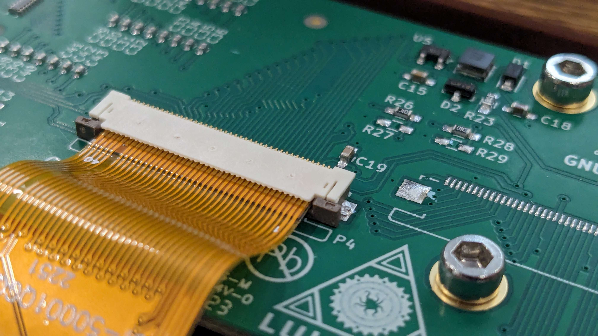

# Display

    

        <h2>Tools</h2>
            <ul>
                <li>M3 Driver</li>
                <li>M5 Driver</li>
                <li>Heatset Insert Tool</li>
                <li>Soldering Iron (Not Included)</li>
            </ul>
            

            <h2>Difficulty</h2>
            
Medium

    

    

    <h2>Hardware Needed</h2>
            <ul>
                <li>M3 Heatset Insert (6x)</li>
                <li>M3x8 Socket Head Cap Screw (7x)</li>
                <li>M3x16 Socket Head Cap Screw (2x)</li>
                <li>M5 T-Nuts (2x)</li>
                <li>M5x10 Button Head Cap Screw (2x)</li>
                <li>Display Panel</li>
                <li>SD Reader</li>
                <li>LCD Controller</li>
                <li>LCD Ribbon Cable</li>
                <li>SD Ribbon Cable</li>
            </ul>
    <h2>Printed Parts</h2>
        <ul>
            <li>LCD Front Cover (1x)</li>
            <li>LCD Rear Cover (1x)</li>
            <li>LCD Bottom Cover (1x)</li>
            <li>LCD Mount (1x)</li>
            <li>Display Spacer (1x)</li>
            <li>Ribbon Cable Clip (1x)</li>
        </ul>
    



 

## LCD Ribbon Installation Steps

1. Loosen the small tabs and open the connector using a small flat-bladed screwdriver. 
2. Gently insert the ribbon cable into the connector until the shiny metallic contacts are fully inserted to the connector.
3. While holding the ribbon in place, use your fingers to latch the connector.
4. Make sure the connector is fully seated, and properly closed.

