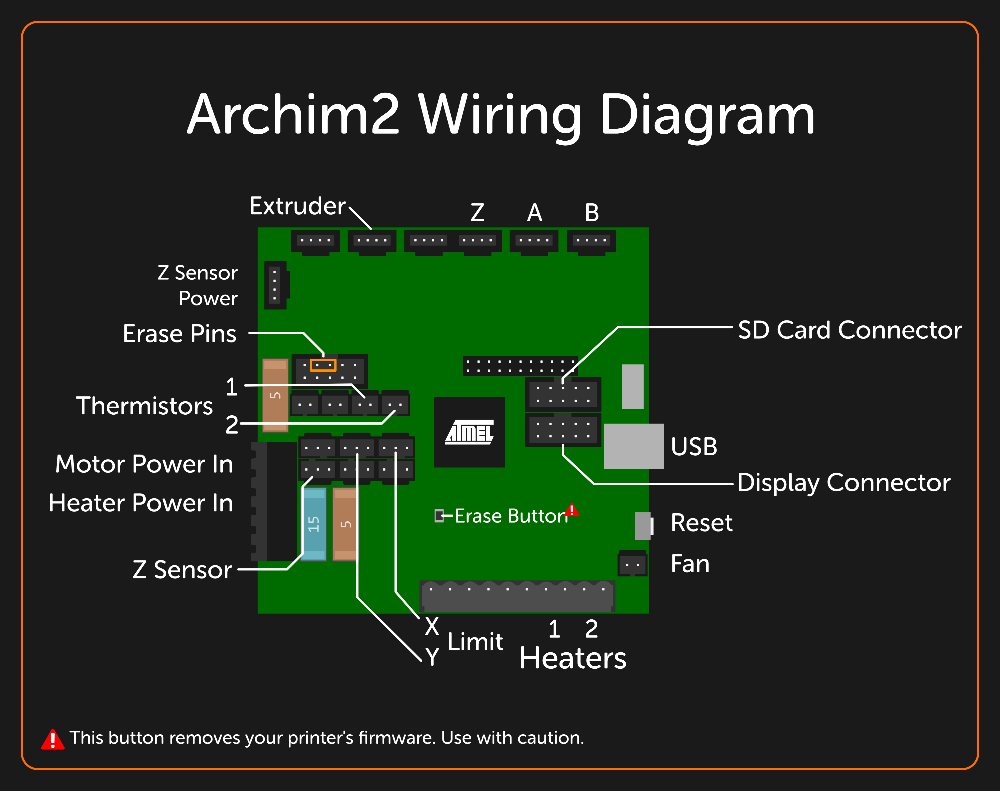
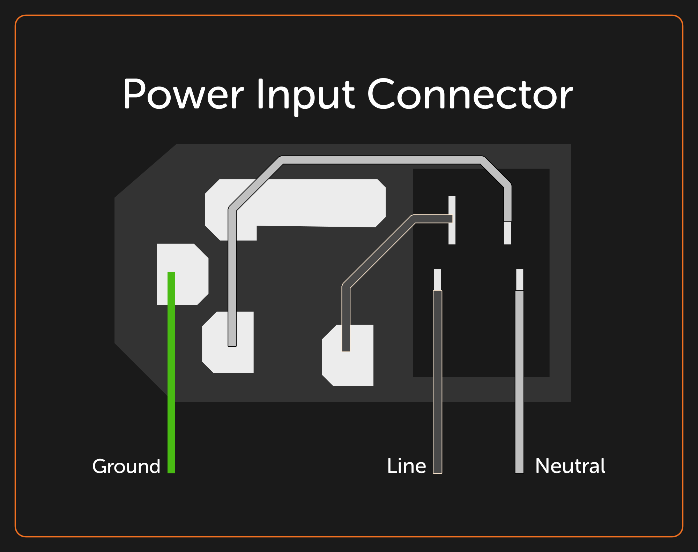

# Electronics & Wiring

## Archim2 Mainboard

!!! warning
    To connect all of the sensors, cables, and ports in your printer, it's important you try to mirror the diagrams and notes below. Failure to do so can result in safety issues.

!!! info
    All of the following direction information assumes that your Archim2 is oriented such that the Atmel logo isn't upside-down.

## Extruder

Your extruder stepper motor connects to the second port from the left.

The thermistor wires for your heater are in ports 1 and 2, closest to the center of the board.

Your heater cables for the extruder connect to the rightmost ports on the bottom for heaters, labeled on the Archim2 as `Heat 0` / `Heat 1`.

## Power Connector

