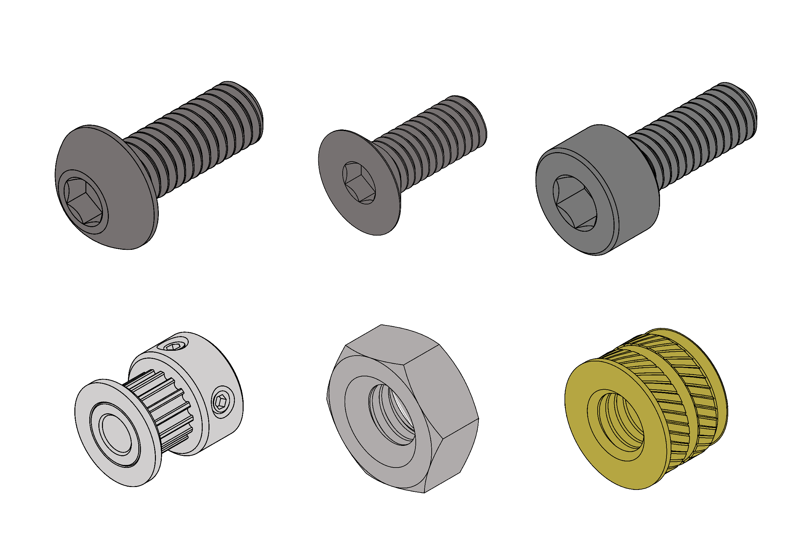
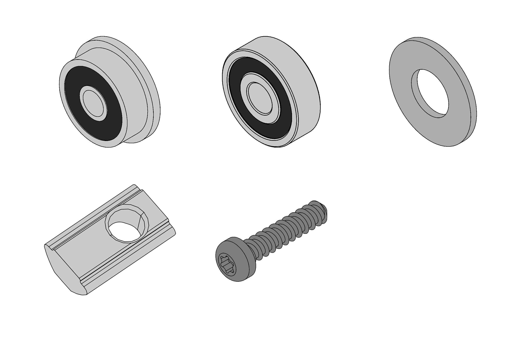
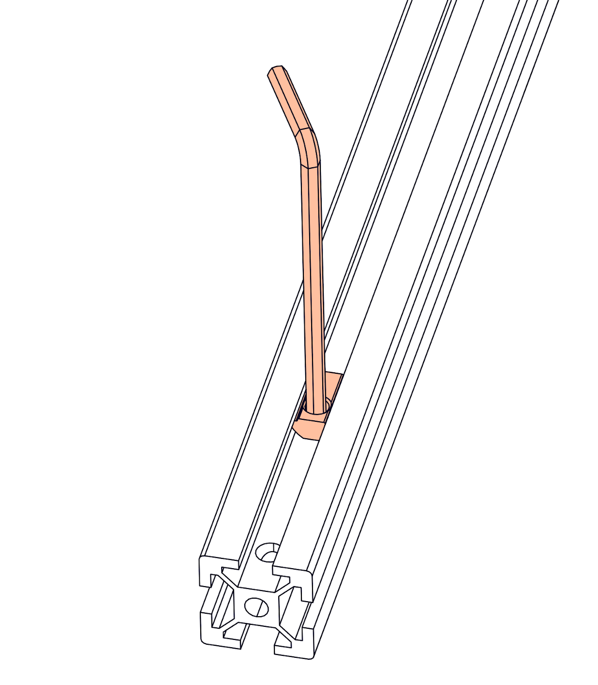

# Hardware Used

In your Cocoa Press, there's a handful of hardware and tools you'll be using repeatedly. Below is an assortment of them for reference.

## Fasteners

## Bearings & Other Hardware

## Extrusion

Blind Joints provide a cost-effective and rigid assembly method for joining extrusions. They will be used throughout the frame assembly.

The head of the BHCS is slid into the channel of another extrusion and securely fastened through a small access hole in the extrusion.

## T-Nuts

We will be using a lot of post install T-nuts, these can be inserted into the extrusion slots at an angle and then rotated to clip into place, they should stay in position and not slide around easily. We will be using both M5 and M3 variants during the build so be sure to install the correct ones at each step.

