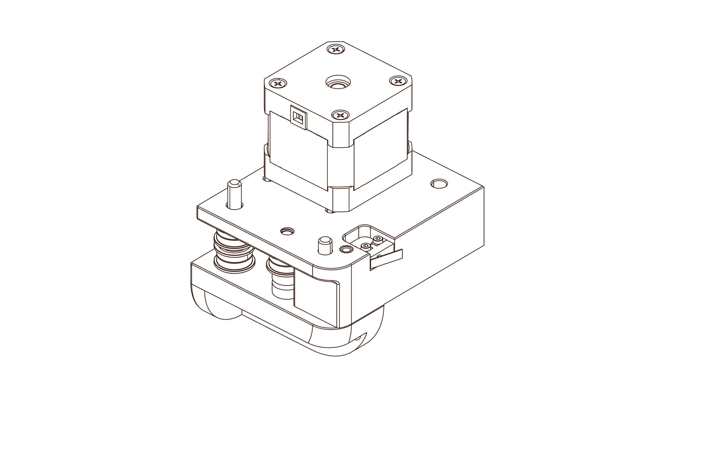

# Assembly Guide

The assembly guide and this documentation are intended to be used as compliments.  Find the assembly manual [here]().

[Assembly Guide :material-arrow-right: ](#){ .md-button .md-button--primary}

<link href="https://cdn.jsdelivr.net/npm/pdfjs-dist@3.9.179/web/pdf_viewer.min.css " rel="stylesheet">

    

  <button id="prev" class="md-button .md-small">Previous</button>
  <button id="next" class="md-button .md-small">Next</button>
  &nbsp; &nbsp;
  Page:  / 

<canvas class="pdf-frame" id="the-canvas" style="width: 100%";></canvas>

## Assembly Guide Sections

  <ul>
    <li>
<strong>Hardware</strong></li>
    <li>
<strong>Extrusion Prep</strong></li>
    <li>
<strong>Frame</strong></li>
    <li>
<strong>A/B Drives</strong></li>
    <li>
<strong>A/B Idlers</strong></li>
    <li>
<strong>Z Axis</strong></li>
    <li>
<strong>X Axis</strong></li>
    <li>
<strong>A/B Belts</strong></li>
    <li>
<strong>Print Bed</strong></li>
    <li>
<strong>Extruder</strong></li>
    <li>
<strong>Electronics + Wiring</strong></li>
    <li>
<strong>Skirt & Panels</strong></li>
    <li>
<strong>Tophat</strong></li>
  </ul>

## Fastener Sheet

if you're unsure what fastener is which, an A4-scale reference sheet is avalible for download [here]().  On it is a 20mm x 20mm square to allow you to measure and confirm your 2D printer's bleed and margins are to scale sufficiently to identify parts.

[Fastener Sheet :material-download:](../assets/fastener_sheet_v3.pdf){ .md-button .md-button--primary}

### Note

PDF.js is licensed under <a href="https://github.com/mozilla/pdf.js/blob/master/LICENSE">Apache License 2.0</a>.

PDF.js example is from <a href="https://jsfiddle.net/pdfjs/wagvs9Lf/">here</a>.