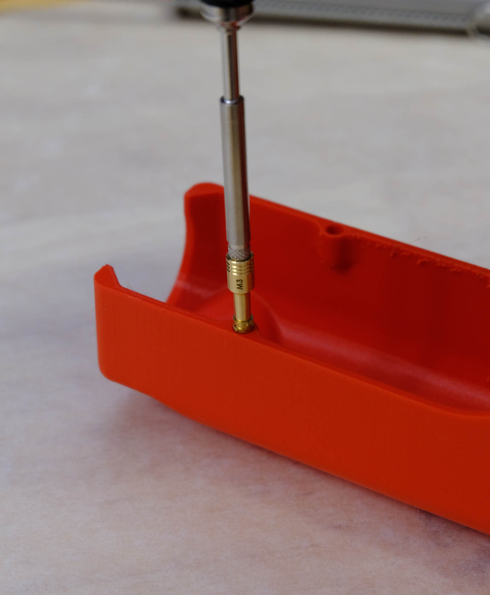

# Before You Begin

Before you start assembling your Cocoa Press, we suggest the minimum avalible to you to make your assembly easier.

## Space

You'll want approximately one eight foot table of space to hold all the parts and tools as you unpack, assemble, and continue on the printer's frame.

## Time

Your printer assembly will take approximately *10-12* hours.  It's heavily suggested you be thorough, take your time, and keep at it.  It'll go by faster than you think.

## Tools

There are some tools you'll need that aren't included in your Cocoa Press Kit.

- Wire Cutters (for trimming zip ties)
- Heat-setting Tool / Soldering Iron (to insert your heat-seat inserts)
    - Your heat-set tool should be capable of fitting M2 and M3 inserts. Test-fit them before beginning assembly.
- Small Phillips Screwdriver (for the button head screws on the exterior of the printer)
- Small Flathead Screwdriver (for wire terminals on the Archim2) 
- Paper Towels (to wipe off any excess chocolate)

### Heatset Technique

When using your heat-set tool, take care to ensure the heatsets are inserted parallel to their final location to minimize drift.  

Additionally, some tools may collide with the printed parts; take care to not melt them.

## Patience

This is the first time this printer has been assembled by *you*.  There may be parts that aren't quite right yet, or aren't clear.  

Don't hesitate to reach out at hello@cocoapress.com so that we can correct any mistakes and clarify the documentation for both you, and for others.

## Thank You!