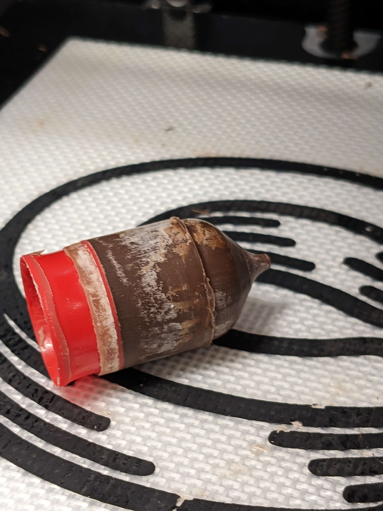

# Food Safety of Chocolate & Your Printer

<!-- ellie section -->

When working with your Cocoa Press, there's certain information that may be useful in understanding minimum food safety requirements.

## Handling

Cocoa Cores should be handled with washed hands, and the silicone baking mat and plungers should regularly be washed and dried carefully.  Cartridges should be washed per the steps shown [here](../Printer/Cleaning.md).

## Contact Surfaces

Some parts of your printer will *not* be able to be considered food-safe even after cleaning, and extruded compound chocolate that comes in contact with these parts should not be considered usable.

 - Z Screw (due to mechanical wear and grease from manufacturing)
 - Z Axis Probe (adhesive tape and plastic body is made of is not inherently food safe)
 - Any Wiring (coatings or labelings are not certified, as well as plastics)
 - FFF Printed Parts (disinfecting porous surfaces)
 - Touchscreen (contact with non-clean portions)
 
## Storing Chocolate

To store your Cocoa Cores for use with your printer safely and easily, you'll want to store it between 60-75F (16-24C), and below 65% relative humidity.

Storage above this point may result in bloom forming on the chocolate.

### Bloom

Over time, most chocolates form "bloom" when exposed to air.  Some form a "fat bloom", where the fat crystals destabilize or change, and some form a "sugar bloom", where the sugar crystals react with moisture.  Many factors can contribute to bloom, but bloom is still safe to eat. 

