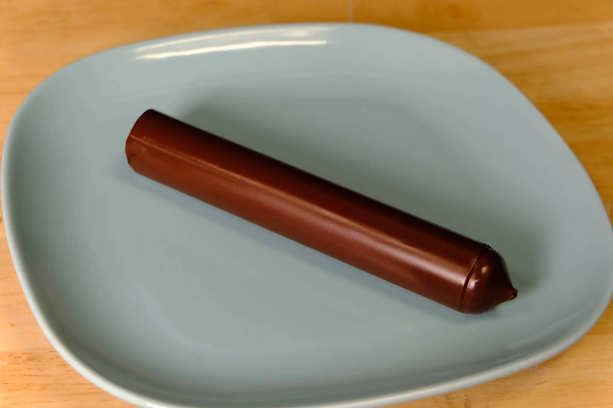
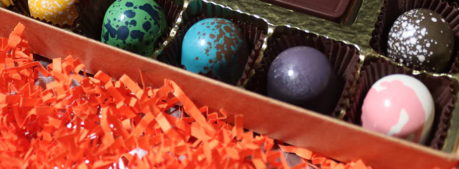

# Types of Chocolate

- Compound Chocolate
- Couveture Chocolate <!-- Real Chocolate -->

<!-- https://bakewithshivesh.com/best-baking-chocolate-compound-or-couverture/ -->

## Compound Chocolate

Compound Chocolates are made from cocoa powder and vegetable oil, to produce a tasty, easier to work with chocolate.  

## Couverture Chocolate

Couverture Chocolates are made from cocoa butter and chocolate liquor, to produce a delicious, temperable chocolate.

!!! info
    A prior version of this page incorrectly titled couverture chocolate as "coverture" chocolate.  These are two wholly distinct concepts, one that of a court system and legal existence, the other a delicious snack.  