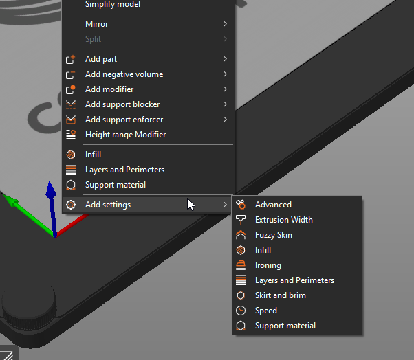
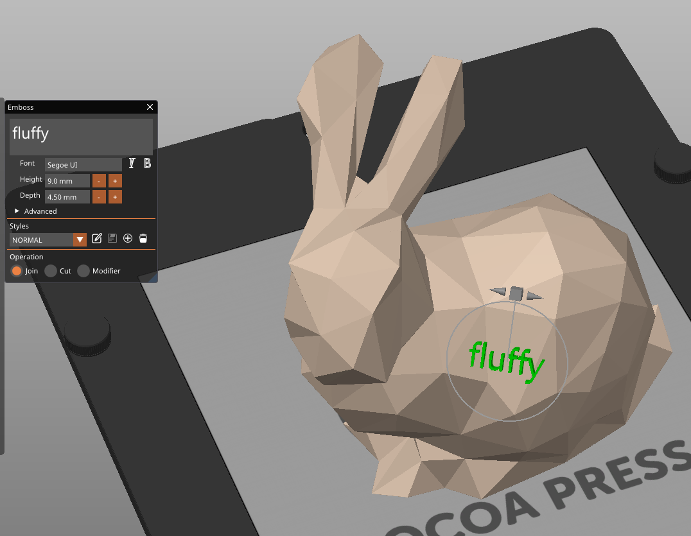
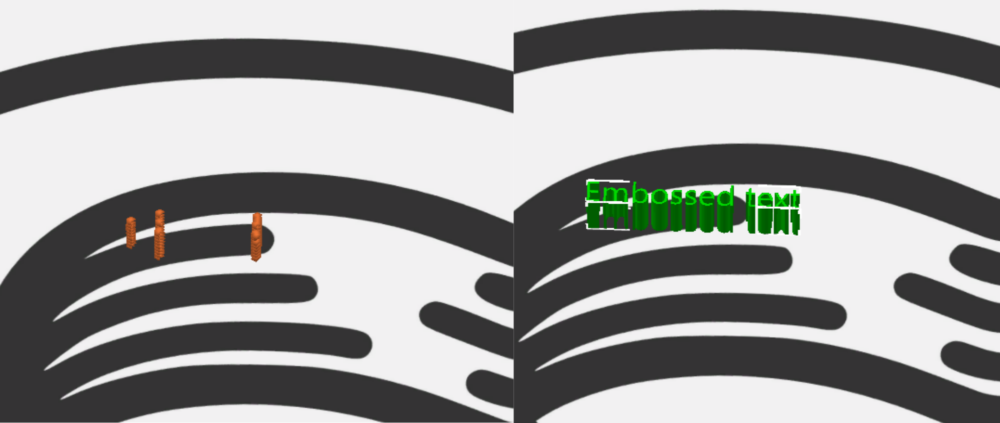
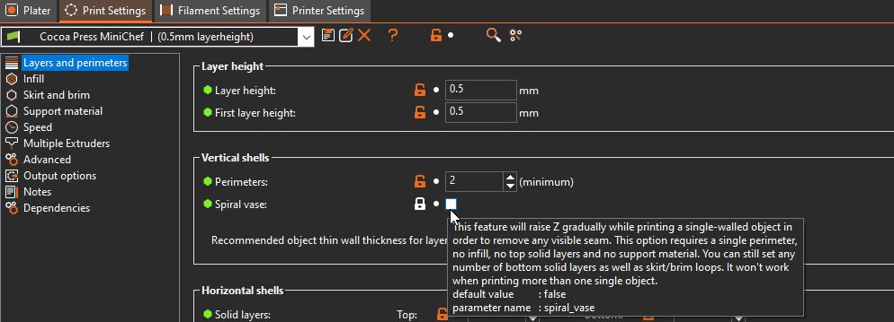

# In-Depth PrusaSlicer Use

## Pause Print

PrusaSlicer and Marlin Firmware allow you to instruct your printer to pause at a given point in the print.  This can allow you to make creative and imaginative prints, like [hot cocolate cocoa bombs](#) <!-- TODO link hot chocolate cocoa bombs and/or add photos. -->

In the [sliced view](../101/Slicer.md#sliced-view--preview-view), use the arrow sliders on the right pane of the view to go up and down through the layers printed, and right click the "plus" icon to bring up the menu. Select "Add pause Print (M601)".

!!! info
    M601 is the specific pause command that also shows a message on the screen to the Prusa family of printers.  This should show M25 if you're on the correct printer in the slicer.  If it doesn't, please verify you've installed the bundle as outlined [here.](#) <!-- TODO verify bundle install stuff -->

## Model Overrides

PrusaSlicer allows you to override specific properties of a model loaded into a slicer, such as infill, speed, temperature, and more.  You can change this from the [3D View](../101/Slicer.md#model-view--3d-view) by right clicking on the part and selecting "Add Settings" at the bottom of the right-click menu.

## Text on Surfaces

PrusaSlicer allows you to add text onto a surface of any model by selecting the model in the [3D View](../101/Slicer.md#model-view--3d-view) and pressing ++t++ on your keyboard, or by right-clicking on the model and selecting the "Add Part" -> "Text" menu item. 

You can use any and all TrueType fonts you have installed on your computer, and can adjust placement with some careful selection.

For more information, look at the [Text tool](https://help.prusa3d.com/article/text-tool_399460) section in the PrusaSlicer documentation.

!!! note
    Do be aware that the slicer will not render text below the resolution of a single linewidth in many cases.  As such, you'll need to make your text large enough to be extruded.

    

## Vase Mode

Vase mode allows you to print certain models as a continuous line circled up and up, allowing for large, thin prints.

To enable, go to Print Settings in PrusaSlicer, Layers and Perimeters, Vertical Shells, and select "Spiral Vase".

!!! info
    The slicer will have to change multiple settings to make this type of print actually manufacturable.  It's important that you check the geometry is able to be printed and doesn't produce any warnings or error messages before printing.  Many vase mode prints will be labeled as such.  for more information, see [Model Selection](../101/Models.md#finding-3d-models-to-print).