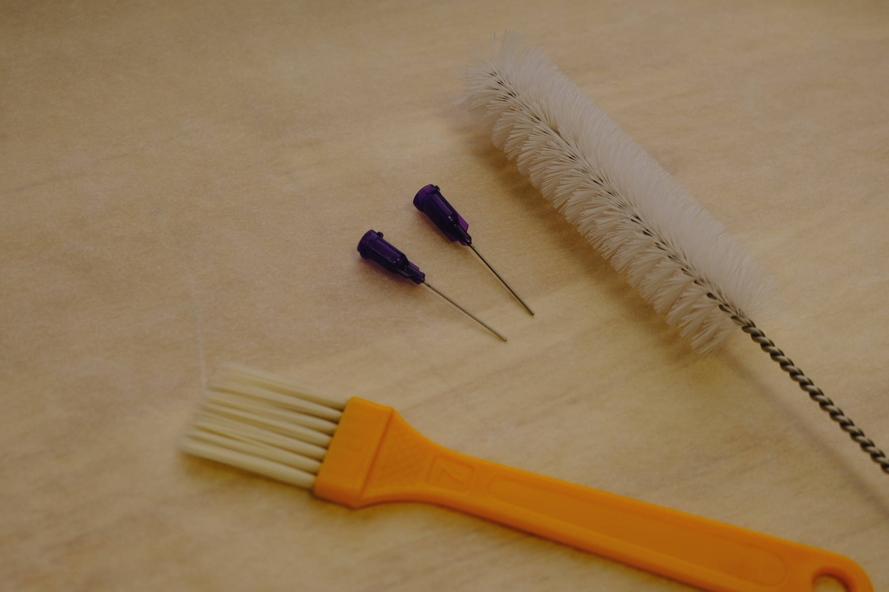

# Cleaning Chocolate Cartridges

Cleaning your cartridges permits you to reuse them for multiple types of chocolate, and is an important sanitary step.

## Needed Tools

- [ ] Flat Brush
- [ ] Tube Brush
- [ ] Soap
- [ ] Warm Water
- [ ] Pushrod

## Steps

### Prep

- [ ] Unscrew the nozzle from the housing.
- [ ] Use pushrod to remove plunger from housing if still present.

### Cleaning

- [ ] Apply soap to tube brush and clean inside of housing with warm water.
    - [ ] Placement under faucet of the brush when not in tube allows each cycle to remove chocolate and allows warm water to dislodge any remaining.
- [ ] Using the tube brush, clean threads of the housing and ensure there’s no chocolate stuck in threads.
- [ ] Using the flat brush, clean up anything left in the nozzle and run under warm water.  Most should be removable with this brush.
- [ ] Using the tube brush’s edge, clean the bottom face of the nozzle, including the tip.

!!! note
    If the nozzle is not thoroughly rinsed out, soap may become trapped inside the nozzle itself, effecting the safety and taste of the food.  Ensure it's thoroughly rinsed.

### Drying

- [ ] Pat dry with paper towels.
- [ ] Allow to air dry completely before use.

### Before Use

- [ ] Check once more for droplets of water.  None should be present, and if so, should not be immediately used.
- [ ] Re-thread nozzle and body to ensure good connection.

