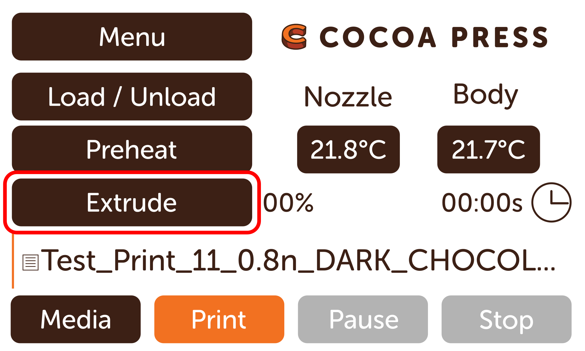

# Loading Chocolate

To load chocolate into your Cocoa Press, you'll need to follow the steps below for best print results.

!!! warning
    This guide assumes that you've already cleaned your cartridges following [this guide](Cleaning.md).  Please do so before attempting to load chocolate, as failure to properly clean your cartridge may cause prints to fail in exceedingly high rates.

## Prep
 - [ ] Wash your hands before handling food-contact components.

## Loading
 - [ ] Insert Cocoa Core into cartridge body via the top opening.

  

 - [ ] Unlatch and tilt back the extruder assembly on the printer carefully.

  

 - [ ] On the home screen, press "Load / Unload" and use the unload (down arrow) option to lower the leadscrew until the plunger adapter is visible.

 

 - [ ] Push the red plunger piece onto the plunger adapter.

  

 - [ ] Use the load menu option to raise the leadscrew above the halfway point.
 - [ ] Insert the cartridge into the extruder assembly and twist until the MJF plunger adapter catches the plunger. 
 - [ ] Twist the cartridge to align with keyed slot and thumbscrew thread.
 - [ ] Use the load menu to raise the cartridge until the thumbscrew socket is aligned with the cartridge body.  
 
 

 - [ ] Use the thumb screw to secure the cartridge in place.
 - [ ] Using the Load / Unload menu, lower the leadscrew until the motor stalls.
    - [ ] This step removes air from the cartridge and ensures print uniformity.

## Print Prep
 - [ ] Tilt the extruder back into the vertical position.
 - [ ] Secure with latch.

 

 - [ ] If printing soon, preheat Cocoa Core using "Preheat" menu.

 

 - [ ] Select the Cocoa Core type you're using to preheat, as a timer is shown on screen counting the twenty minutes down to ensure consistent preheating.

 

!!! note
    Ensure the firmware version you're on is up to date if using white chocolate. Those temperatures may change over time as we dial in our settings.

 - [ ] Once timer expires, press and hold "Extrude" on main menu to gently extrude the now softened Cocoa Core.

 
 
## Done!

You're now ready to print your next amazing creation!

## Unloading

In your kit is also provided a delrin push-rod, to make removing the plungers easier should they become stuck inside a cartridge.  Simply unscrew the nozzle and use the push rod to firmly eject the cartridge before washing thoroughly.