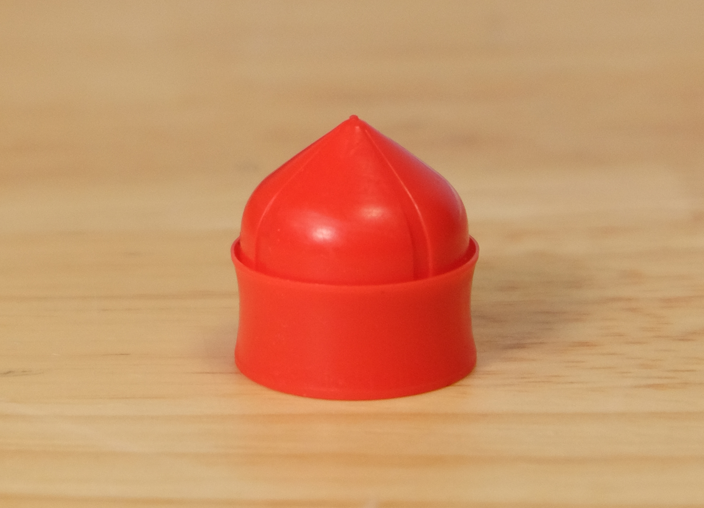
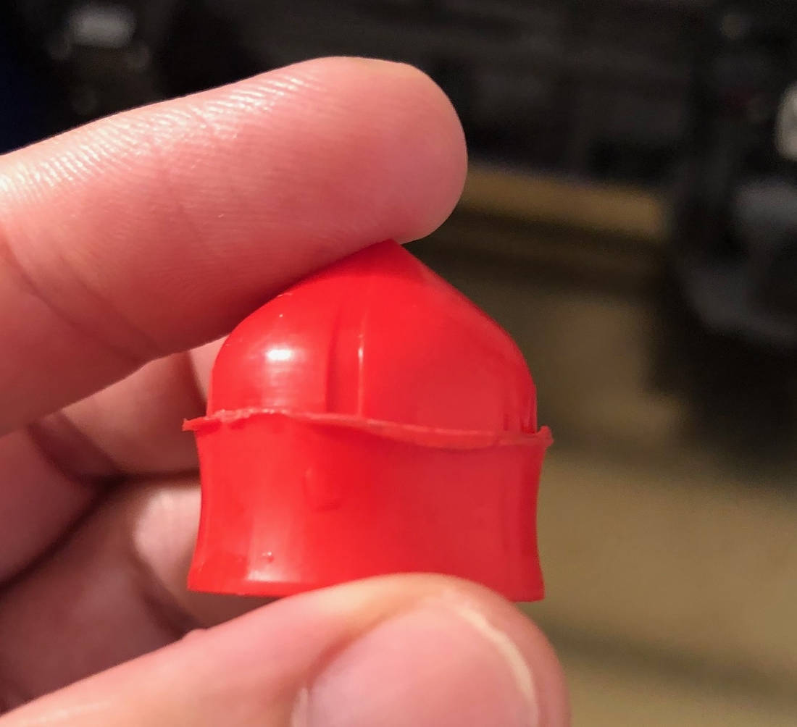

# Plunger Health and Cleaning

The plunger is a mechanically important part of your Cocoa Press. Responsible for both compressing the liquedous compound chocolate, and allowing air to escape past the top, it's a core part of keeping your fused food fabrication prints edible and safe.

However, these parts are *wear* parts, and will need to be replaced over time.

## Good Plungers

Good plungers have intact upper lips, as well as appear relatively circular.  Any damage takes it into the below category.

## Worn Plungers

Worn plungers may have damage to their seal lip, or have collapsed, been crushed, or otherwise don't function as intended.  These should be disposed of.

<!-- TODO PLACEHOLDER replace Marcio photo. -->

## Cleaning Steps

 - [] Wipe or break off any large chunks of chocolate with paper towels.
 - [] Submerge plungers in warm water for approximately ten minutes to soften chocolate stuck between gaps.
 - [] Using tube brush, clean inside ridge of plunger to remove interior chocolate.
 - [] Pat dry with paper towels, then allow to air-dry.
 - [] Double-check all chocolate is removed from interior groove.
