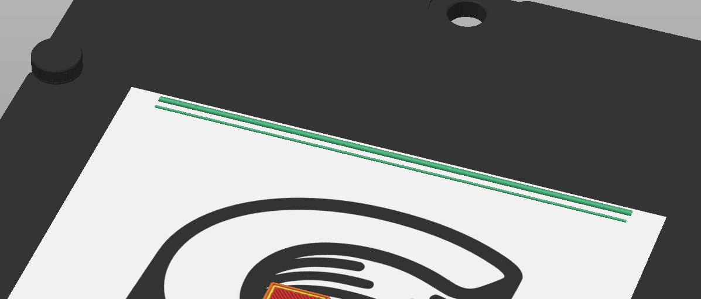
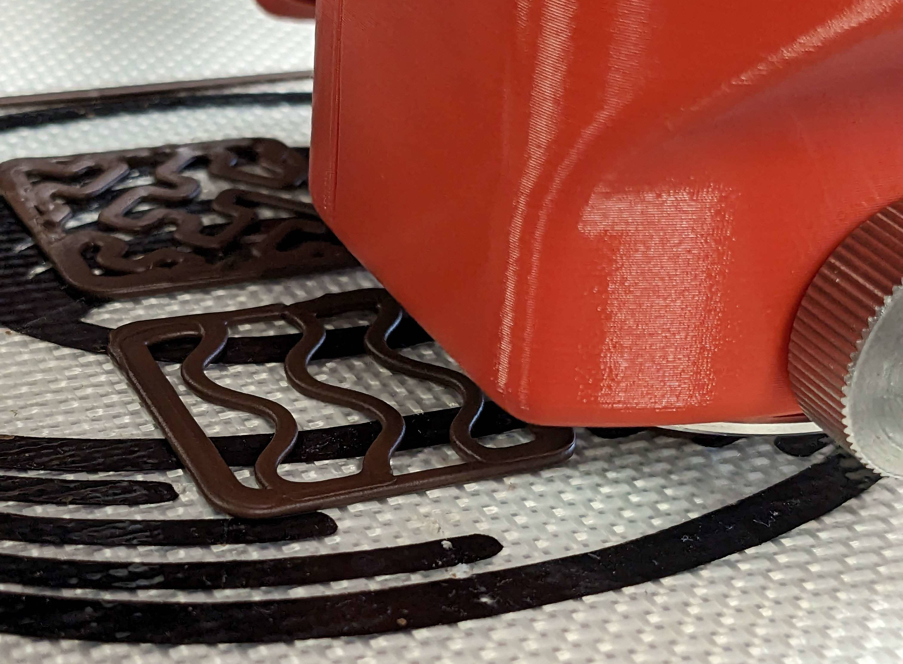

# Printing With Your Cocoa Press

Once you've gone through the quickstart and verified your printer is running well, and you've loaded chocolate, you're ready to begin printing with your Cocoa Press!

## Prerequisites

 - [ ] Your Cocoa Press should have the preheating timer run out, meaning that it's had time to warm up the core for printing.
 - [ ] You should have probed the mesh bed leveling of your printer, as well as set the Z offset per this guide [here.](#) <!-- TODO add link to probing and meshing? -->

## Steps

- [ ] Load your Gcode onto your Cocoa Press by copying the GCode file the slicer made to an SD card, or use one of the pre-made GCode files that came with the printer.
- [ ] Select the "Media" menu.

<!-- TODO add photo of main menu with media selected -->

- [ ] Select your GCode file with the media button.

!!! info
    Custom GCode made with PrusaSlicer and Cocoa Press' profiles since version 1.1.0 should include the print time, chocolate used, and more in the filename.  If this isn't shown, the user should update their profiles within PrusaSlicer.

- [ ] When asked if you want to start that file, press "yes" to begin the print.
- [ ] The printer will begin the print by probing homing the X and Y axes, and then the Z height.  Then, it begins a purge line, to remove any printed debris on the printer'snozzle.  Depending on the profile this may vary.

- [ ] Supervise the first layer to ensure good bed adhesion.  Your first layer should be in contact with the silicone baking sheet, but not tearing into it.  

## Printing In Operation

Provided the first layer successfully completed, all you'll need to do is let the printer continue the print until done.  When done, the printer will play a jingle to let the user know when the print is successfully done.