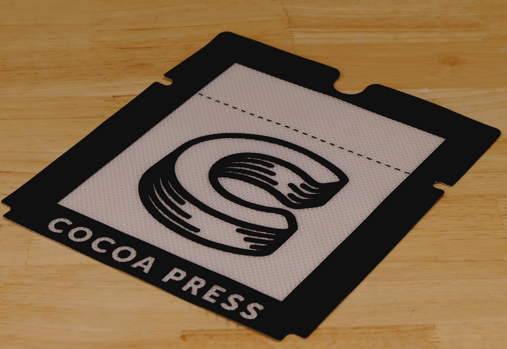

# Cleaning Your Print Surface

Using your printer may result in cocoa core debris being left on your silicone baking sheet, or becoming dirty over time.  Follow the steps below to maintain ideal use of your printer.

## Required Supplies

- [ ] Print Surface / Silicone Baking Sheet
- [ ] Warm Water
- [ ] Soap
- [ ] Cleaning Brush and/or Sponge
- [ ] Paper Towels

## Steps

### Prep
- Run warm water over silicone baking sheet to soften any remaining extruded material.
- Apply soap to sponge or cleaning brush.

### Cleaning
- Use brush to remove any debris on print surface.
- Ensure that any dust or other debris on print surface from environment is entirely removed before removing from water.

### Drying
- Pat Dry with paper towels.
- Allow to air dry completely before use.

### Before Use

- Ensure no water droplets or residues are remaining after cleaning.  If present, repeat steps until clean.