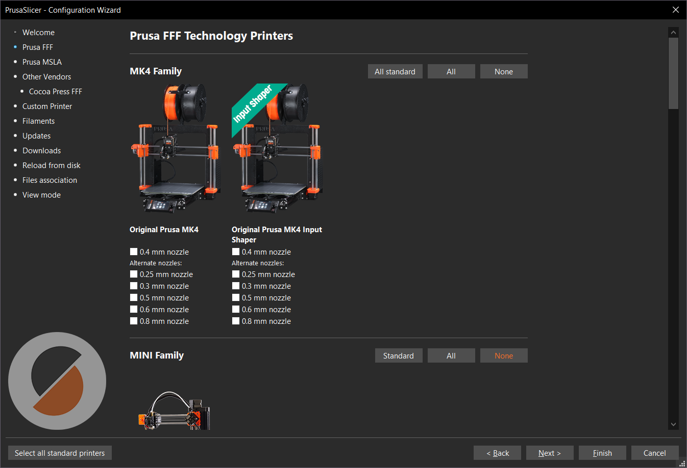
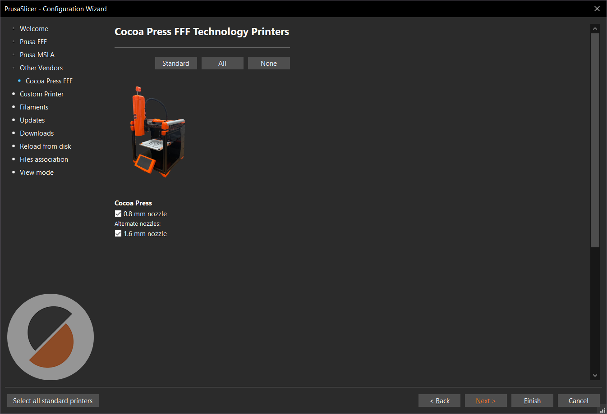
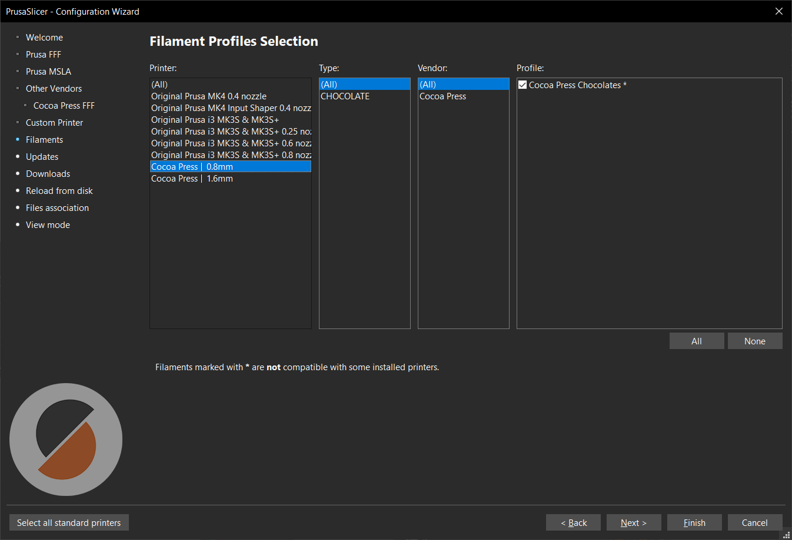
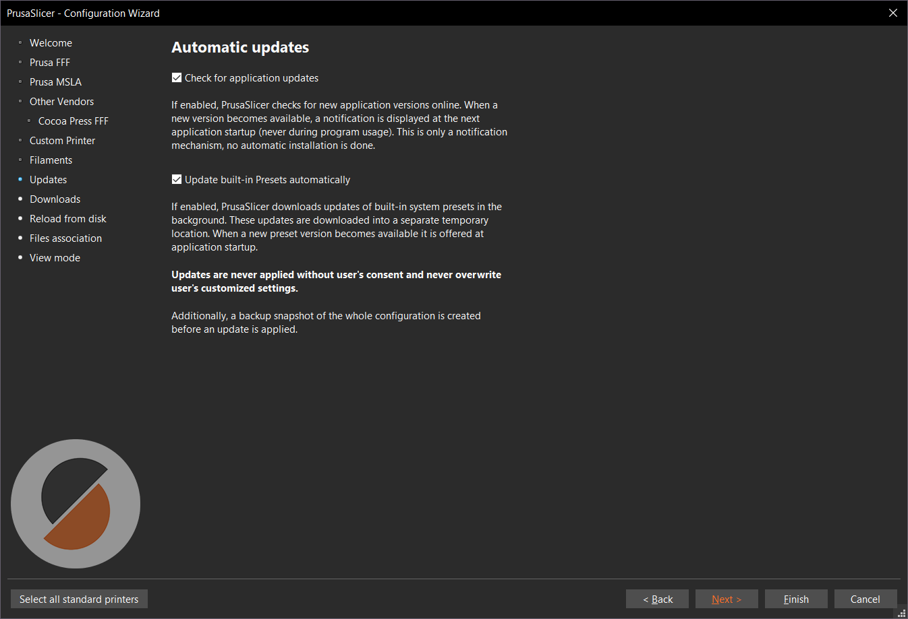
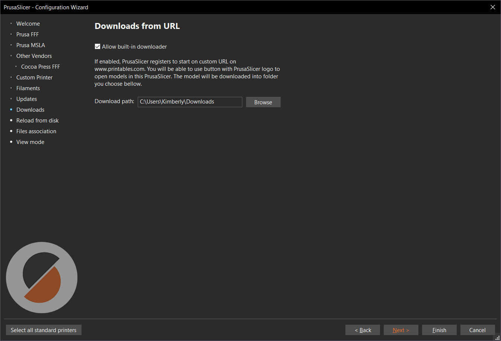
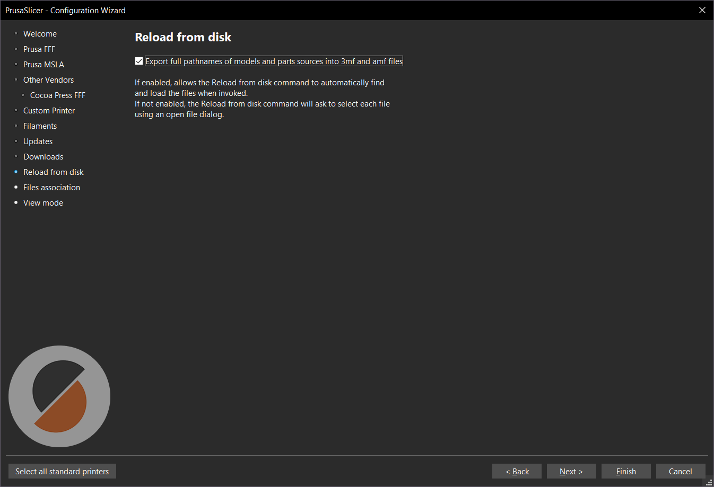
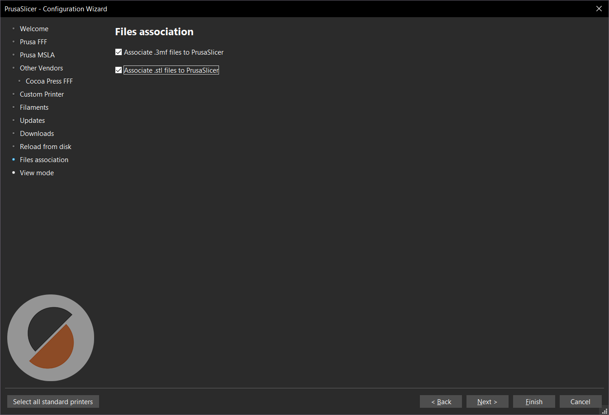
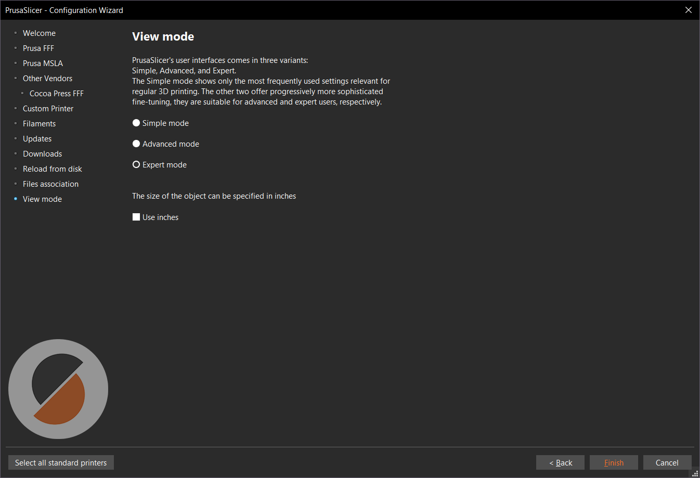

# Setting Up PrusaSlicer

To produce the correct files for your Cocoa Press, you'll need to set up PrusaSlicer as shown below.  This minimizes the risks of giving the printer instructions that may damage it.

## Downloading

You can download PrusaSlicer [here](https://www.prusa3d.com/page/prusaslicer_424/) for macOS, Windows, and Linux installations.

[PrusaSlicer Download :material-download:](https://www.prusa3d.com/page/prusaslicer_424/){ .md-button .md-button--primary}

## Configuration Wizard

Once PrusaSlicer has been installed, you'll need to go to the Configuration Wizard to add your Cocoa Press.  It should open automatically when you launch the slicer for the first time.  If not, it can be started by opening the "Configuration" menu and pressing "Configuration Wizard".

This section is for setup of Prusa FFF printers.  Feel free to skip this area without selecting a printer if you don't have one.

Select the Cocoa Press machines with the nozzle diameters you have.

!!! info
    PrusaSlicer views different nozzle sizes as different "machines" due to configuration differences.  Select the appropriate nozzle diameters you might use regardless of how many physical printers you have.

Validate that your printer profiles include a "filament type" of "CHOCOLATE'.

It's *highly suggested* that PrusaSlicer's automatic configuration updates and application updates are enabled to ensure you get the latest Cocoa Press machine settings.

If you intend to download 3D models from Printables, this option allows you to click-to-open from the website to launch them directly into the slicer.

