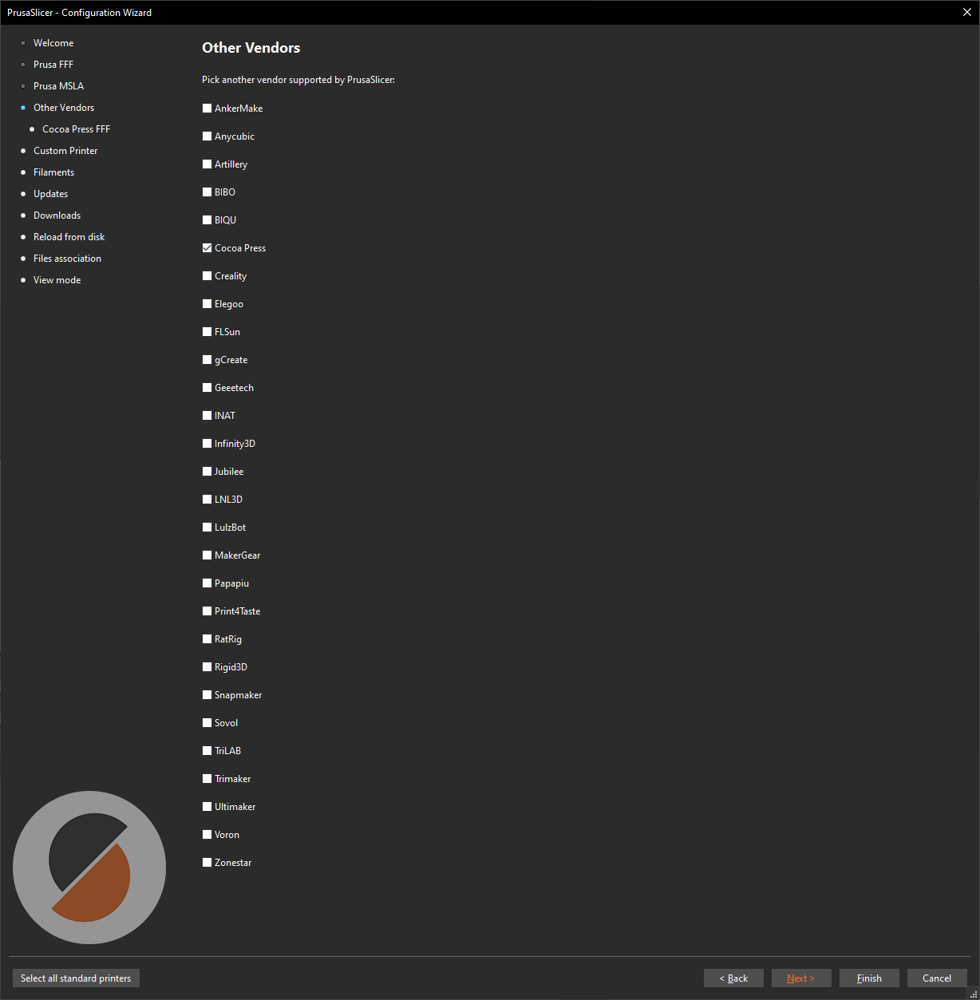

# Setting Up PrusaSlicer

To produce the correct files for your Cocoa Press, you'll need to set up PrusaSlicer as shown below.  This minimizes the risks of giving the printer instructions that may damage it.

## Downloading

You can download PrusaSlicer [here](https://www.prusa3d.com/page/prusaslicer_424/) for macOS, Windows, and Linux installations.

[PrusaSlicer Download :material-download:](https://www.prusa3d.com/page/prusaslicer_424/){ .md-button .md-button--primary}

## Configuration Wizard

Once PrusaSlicer has been installed, you'll need to go to the Configuration Wizard to add your Cocoa Press.  It should open automatically when you launch the slicer for the first time.  If not, it can be started by opening the "Configuration" menu and pressing "Configuration Wizard".

Select "Cocoa Press" as a vendor for use.  This should be an option for all versions of PrusaSlicer 2.6.0 and newer.

!!! info
    If Cocoa Press isn't shown as an option, you may need to update you configurations later in the wizard.

This section is for setup of Prusa FFF printers.  Feel free to skip this area without selecting a printer if you don't have one.

Select the Cocoa Press machines with the nozzle diameters you have.

!!! info
    PrusaSlicer views different nozzle sizes as different "machines" due to configuration differences.  Select the appropriate nozzle diameters you might use regardless of how many physical printers you have.

Validate that your printer profiles include a "filament type" of "CHOCOLATE'.

It's *highly suggested* that PrusaSlicer's automatic configuration updates and application updates are enabled to ensure you get the latest Cocoa Press machine settings.

!!! note
    If CocoaPress wasn't visible as a vendor above, this is the setting you need to ensure is enabled.

If you intend to download 3D models from Printables, this option allows you to click-to-open from the website to launch them directly into the slicer.

Use these two options to associate STL and 3MF files with PrusaSlicer. Your computer will then try to open both with PrusaSlicer by default.

If you intend to change slicer settings to get more experimental or interesting prints, you may need to turn on "Expert" mode to enable all options.

Done!