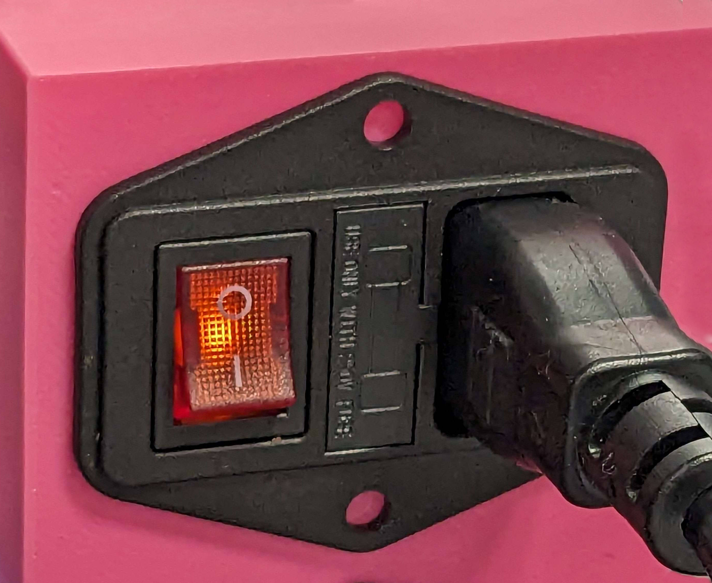

# Quickstart Guide

To bring up your Cocoa Press, there are some checks and steps you’ll want to take before assuming your printer is completely ready.  

## Electronics Checks

 - [ ] Is your power supply switch in the correct mode for your region?
 - [ ] When power is enabled for the printer, the power switch indicator should light up. Is the light on?

 - [ ] When power is turned on, do the lights on your main board turn on?  If so, it’s been successfully wired.

## Self-Test Steps

Cocoa Press has written a guided test to help you verify your printer functions as intended.  Included on the SD Card that comes with your printer will be "test.gcode".

!!! info
    Some early printers may not have this file present.  Users can be download the file [here](../assets/test.gcode).

## Leveling & Meshing

- [ ] Using the menu, choose the Mesh Leveling section and permit your printer time to probe all 25 points in the bed mesh.
  - [ ] This may take some time, but is used to compensate for any small warping or distortion in the frame or printed parts.
- [ ] Using a piece of paper, follow the steps on-screen to set your Z-Offset from the Z-Offset menu.

## Good to go!

If you've made it this far, you should be ready to print your culinary creations!

## Loading Chocolate

To print with chocolate, you'll want to follow the loading steps to minimize potential failure modes, as well as increase the quality of your prints.

[Load Chocolate :material-arrow-right: ](Loading.md){ .md-button .md-button--primary}

## Cleaning Your Cartridges

To re-use your chocolate cartridges, it's important to clean and sanitize them to avoid any potential contamination.

[Cleaning Cartridges :material-arrow-right: ](Cleaning.md){ .md-button .md-button--primary}