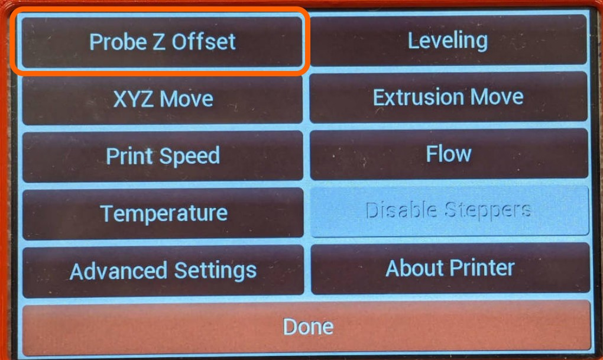
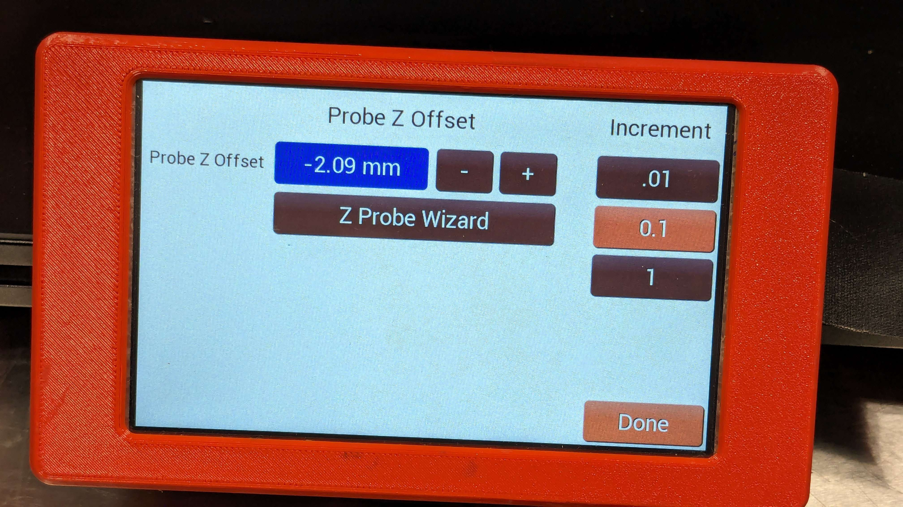
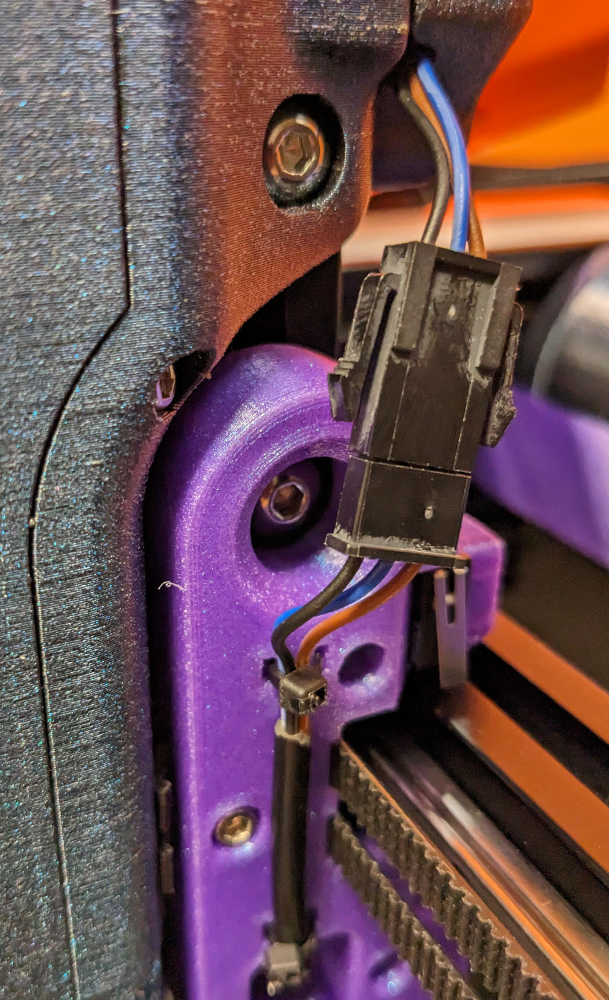

# Common Issues

## Nozzle is dragging into the silicone baking sheet!

You'll want to use the Z-Probe Offset menu item to lift your nozzle away from the print surface.

## My nozzle clogs often!

It's possible the stock temperatures are too cold for your environment.  This is especially true for seasonal swings.  It's suggested you print a "known good" model and increment the body and nozzle temperature by .1C after giving it time to more evenly distribute the heat. 

Also be sure to use the [Cleaning Tools Kit](https://cocoapress.com/products/cleaning-tools) to ensure there's no blockages from repeatedly heating and cooling a Cocoa Core without purging that material.

## Bed Isn't Level

If your printer's bed looks slanted when looking at it head on, but the printer can successfully probe the meshing area, use the `View Mesh` button to inspect the major differences between corners. 

<!-- TODO add photo of "view mesh" button -->

The maximum we'd suggest at opposite corners is about 3mm.  If your printer exceeds this, it's highly suggested you perform the initial assembly steps in the [Assembly Manual](../Assembly/index.md) where the bed screws are adjusted.

Furthering this, you may also need to inspect and potentially re-print the plastic pieces supporting the bed, as warping in this area can signficantly effect the bed leveling.

## Z-Offset

If probing completes successfully, you'll need a sheet of plain printer paper to adjust the Z-offset.  Using the `Menu` -> `Probe Z Offset`.  Follow the steps on screen to adjust the spacing between your nozzle and bed for a consistent first layer.

## Wobbly or Loose Frame

In the event of major movement or vibration, your printer's fasteners may loosen over time.  Tightening these again like done during initial setup should help with this.

## Printer Rocks During Printing

It's possible the rubber feet on the printer may have become dislodged during printing.  Replacing the missing foot or producing a leveling shim may resolve the issue temporarily.

If all rubber feet are present, inspecting that the printed pieces aren't warped and that the frame itself is level and square is a useful mitigation.

## Dirty Probe

When printing, it's possible stringing or nozzle issues may result in your Z-Offset Probe becoming dirty.  

Disconnect the cable lead as shown in the photo, unscrew the two M3s, and wipe the sensor off thoroughly with paper towels. 

 Do not use water, and be sure to (re-probe) and (re-mesh) the bed afterwards.

In the event of further issues, you'll want to contact support for help via the email <a href="mailto:hello@cocoapress.com">hello@cocoapress.com</a>

