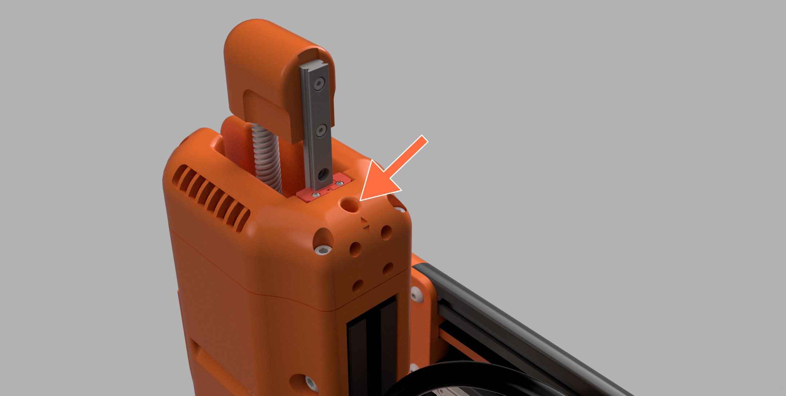

# Extrusion & Printing Troubleshooting

## First Layer Height Issues

To ensure a consistent and reliable first layer with your Cocoa Press, you'll need to ensure your Z probe is mounted ridigly via the two M3 screws, and that your extruder doesn't wobble during normal operation.

You'll also need to ensure that your printer has probed the print bed for consistently and leveling.  

### Probe Mesh Area

This can be checked in the menu under Menu -> Mesh Leveling -> Probe Mesh.

The printer will take about three minutes and probe the printable area of the bed.  If this step collides with anything, you'll want to look into [adjusting your extruder height.](#adjusting-extruder-height)

<!-- photo of probing in progress -->

### Z-Offset

If probing completes successfully, you'll need a sheet of plain printer paper to adjust the Z-offset.  Using the Menu -> Probe Z Offset.  Follow the steps on screen to adjust the spacing between your nozzle and bed for a consistent first layer.

Your paper should slide under the nozzle with a small amount of resistance, but not enough to tear or catch. This will ensure the nozzle can skim the top surface of the silicone baking sheet would damaging it, and keeping the first layer consistent.

## Adjusting Extruder Height

Your Cocoa Press includes an M5 screw inside the extruder motor assembly that can be used to raise and lower the extruder relative to the extrusion it's mounted to.

First, loosen the four M5 screws on the side holding the printed housing pieces to the extrusion.

Then, Turn the M5 screw in the top left or right to raise or lower the screw.  

!!! note
    Turning clockwise will *lower* the assembly closer to the bed, so to avoid colliding with the bed, you'll want to turn it counter-clockwise.

Once the extruder is in a place where the bed can be raised to a space to trigger the Z-probe *without *colliding with the silicone baking sheet or the bed, re-tighten the four M5 screws on the extruder printed parts.

Then, re-probe your bed mesh and run the Z Adjust Offset wizard again to ensure no data from before the adjustment is present.

## Extruded Line is Wobbly

If your print has lines or vibrations that appear during fast moves, you may need to tighten the bolt used to latch the extruder's pivot in place.

<!-- add close-up photo of extruder pivot -->

If this doesn't resolve the issue, you may also want to check the screw in the pivot of the extruder, as well as the button head used to retain the socket head screw listed above when latched.