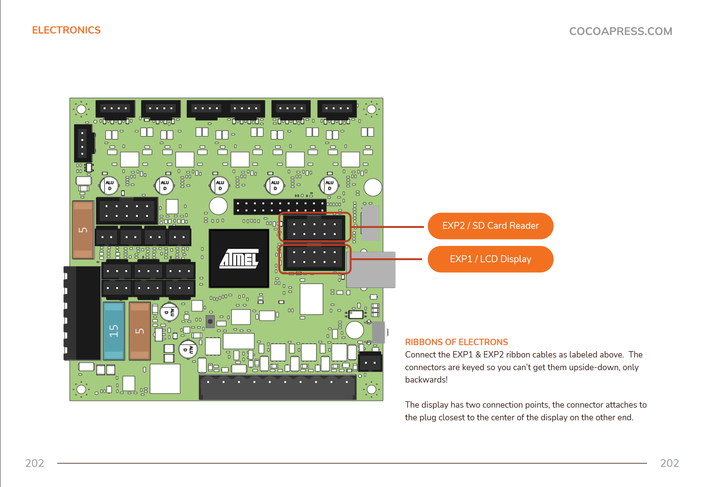

# Initial Setup Troubleshooting Walkthrough

A choose-your-adventure in making fixing your Cocoa Press not quite as much of an adventure.  Not all potential issues are reflected below, please check the [Advanced Troubleshooting](../Advanced/Troubleshooting.md) for more troubleshooting steps.

Click / tap the item that best describes your circumstances to expand and continue.

???+ question "Screen Won't Turn On"

    In the rear of the unit, are there any illuminated lights?

    The power switch should have an amber indicator when switched on.

    ??? failure "Power Switch Won't Illuminate"

        Verify that your power switch matches the diagram as shown in the [Assembly Manual](../assets/assembly_manual.pdf) on/around page 174.  Failure to do so may cause further electrical issues.

        

    

    ??? success "Power Switch Is Illuminated"

        Peering through the fan grill on the rear of the printer, are there lights visible?  

        A normally functioning printer should have a solid green light as depicted below (power), and a flashing red light below it (fan) upon initial startup.

        ??? failure "No Lights"

            You'll want to verify the following:

            - Ensure that your region switch on the power supply is set to "110V" if in the United States or Canada.  Unplug the printer, and then remove the right-side panel of the machine with a Phillips screwdriver to visually inspect the switch.

            *Tip*: It's possible for the switch to be partially set.  Ensure it is all the way over to form a solid and safe electrical contact.

            

            - Verify that your power supply output wiring mirrors the assembly manual on/around page 183.

            

            Failure to connect both sets of power leads will result in the Archim not powering on.

            - Additionally, ensure that a fuse is in the fuse holder of the power connector unit, and that it's not damaged or tripped.

        

        ??? warning "Only The Green Light is On"
        
            It's possible that your printer did not have the full release firmware applied to it during production.  Please refer to the [Flashing Steps](../Advanced/Flashing.md) to apply the current production firmware to your printer.

        ??? success "Both Lights Are Visible"

            Given this, it's possible that the ribbon cable to your display is connected incorrectly, or got swapped for the SD reader's ribbon cable.  If the cables are swapped, turn off the printer and correct the ribbon cables for your SD reader and LCD to match the diagram in the assembly manual.

            
            
            Wait ten seconds, and then turn the printer back on.  
            
            Now, does the screen light up?

            ??? failure "Still Nothing on Screen / The screen is all white"

                The flat flex cable in your printer that connects the display panel to the display controller is a delicate connector, and may need to be reinserted.  Small amounts of dust or debris can damage or render the connection unstable.
                
                Follow the assembly manual section and re-verify that the cable is fully seated in the connector of the display controller.

            ??? success "The screen shows the Cocoa Press logo!  Yay!"

                Given this, you've successfully gotten through the initial electrical issues your printer might have.  Please refer to [Advanced Troubleshooting](../Advanced/Troubleshooting.md) if more issues persist.

