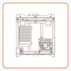

---
hide:
  - feedback

glightbox: false
---

# Troubleshooting

Sorry you've having issues with your printer, what seems to be the problem?

<ul>
<li><a href="/101/">
<strong>Mechanics & Frame</strong></a></li>
<li><a href="/Printer/">
<strong>Electronics & Wiring</strong></a></li>
<li><a href="/Chocolate/Types.html">
<strong>Extrusion & Printing</strong></a></li>

<li><a href="101/Slicer.html">
<strong>Slicing & Slicer Profiles</strong></a></li>
<li><a href="/Troubleshooting/">
<strong>Something Else</strong></a></li>
</ul>

